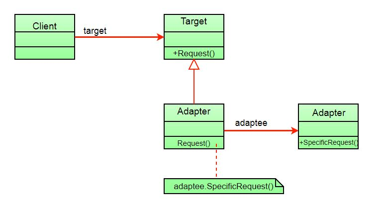

# 适配器模式
> 适配器可以将不兼容的接口通过适配做到统一，方便用户使用

## 介绍
适配器模式其实很好理解，因为现实生活中到处都是这样的例子。比如type-c转USB，可以完成不同设备之间的文件传输。

它允许将现有类的接口用作另一个接口。总之，适配器可以帮助两个不兼容的接口协同工作。在设计中，当我们有一个类需要某种类型的对象并且我们有一个提供相同功能但接口不同的对象时，就会使用适配器。

## 特性



- 客户端通过使用目标接口调用适配器的方法向适配器发出请求
- 适配器使用适配器接口在适配器上转换该请求
- 客户端收到调用结果并且不知道适配器的存在

## 例子
在这里，我们有两个不兼容的接口：MediaPlayer和MediaPackage。MP3类是MediaPlayer接口的实现，MP4类是MediaPackage接口的实现。我们想使用MediaPackage的实现类作为MediaPlayer实例，因此，我们需要创建一个适配器来帮助处理两个不兼容的类。


首先定义接口：
```java
public interface MediaPlayer {

    void play(String source);
}
```
```java
public interface MediaPackage {

    void playFile(String name);
}
```
再定义MP3和MP4类实现上面的接口
```java
public class MP3 implements MediaPlayer {

    @Override
    public void play(String source) {
        System.out.println("Playing MP3 File " + source);
    }
}
```
```java
public class MP4 implements MediaPackage {

    @Override
    public void playFile(String name) {
        System.out.println("Playing MP4 File " + name);
    }
}
```
接下来就是重点，我们定义一个适配器。这个适配器实现目标接口MediaPlayer，再在适配器中创建MediaPackage实例，调用接口方法。
```java
public class FormatAdapter implements MediaPlayer {

    private final MediaPackage media;

    public FormatAdapter(MediaPackage media) {
        this.media = media;
    }

    @Override
    public void play(String source) {
        System.out.print("Using Adapter --> ");
        media.playFile(source);
    }
}
```
至此就完成了适配器，我们来测试一下效果
```java
public class Main {

    public static void main(String[] args) {
        MediaPlayer player = new MP3();
        player.play("file.mp3");

        player = new FormatAdapter(new MP4());
        player.play("file.mp4");
    }
}
```
输出结果
```
Playing MP3 File file.mp3
Using Adapter --> Playing MP4 File file.mp4
```

## 结论
适配器模式有助于实现可重用性和灵活性，并且可以使用多态在不同的适配器实现之间进行交换。但缺点就是所有请求都被转发，因此开销略有增加，有时需要沿着适配器链进行许多调整才能达到所需的类型。

源代码见[github](https://github.com/surzia/design-pattern)