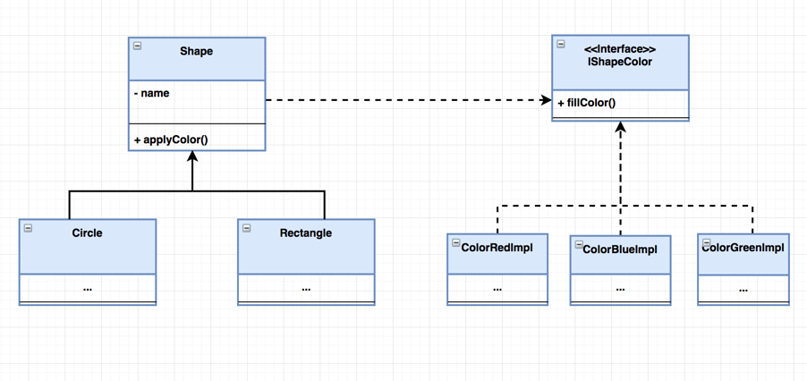

# 桥接模式
> 桥接模式将抽象部分和实现部分分离，是一种结构化的设计模式

## 介绍
桥接模式中有两部分：
- 抽象类
- 实现类

这是一种将实现类封装在接口类内部的设计机制。
- 桥接模式允许抽象和实现独立开发，客户端代码可以只访问抽象部分而不必关心实现部分。
- 抽象是接口或抽象类，实现者也是接口或抽象类。
- 抽象包含对实现者的引用。抽象的孩子被称为精炼抽象，实现者的孩子是具体的实现者。 由于我们可以在抽象中更改对实现者的引用，因此我们可以在运行时更改抽象的实现者。 对实现者的更改不会影响客户端代码。
- 它增加了类抽象与其实现之间的松散耦合。

## 结构
桥接模式的UML图如下所示

- Abstraction：桥梁设计模式的核心并定义了具体问题。包含对Implementer的引用
- Refined Abstraction：扩展抽象，将更精细的细节向下一层。对Implementer隐藏更精细的的细节
- Implementer：它定义了实现类的接口。这个接口不需要直接对应抽象接口，可以有很大的不同。抽象类根据Implementer接口提供的操作提供了一个实现
- Concrete Implementation：通过提供具体实现来实现上述Implementer

## 例子
现在有一个场景，并且不断有需求更新。
#### **需求1**：实现一个程序，能够画圆形和矩形

#### **需求2**：实现一个程序，能够画圆形和矩形，颜色为红色和蓝色

#### **需求3**：实现一个程序，能够画圆形和矩形，颜色为红色、蓝色和绿色

向任何形状添加一个颜色实现需要为每个形状类型添加一个类，想象你有N种不同颜色的N种形状类型的场景......

这时就可以采用桥接模式来设计程序。

源代码见[github](https://github.com/surzia/design-pattern)
