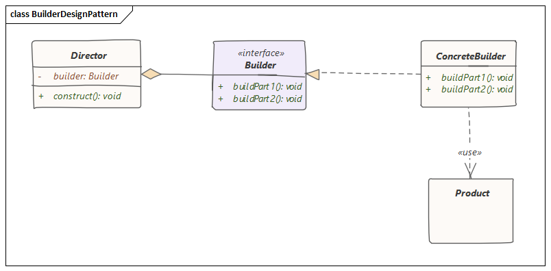

# 建造者模式

> 建造者模式允许使用正确的操作顺序来创建一个复杂的对象。构造过程由一个主管对象负责，该对象仅需要知道要创建的对象类型。

## 图解



建造者模式中包含以下重要部分：

- **Product**：定义了由简单对象逐步构建复杂对象的类
- **Builder**：抽象类/接口，定义了产生复杂的Product对象所需执行的所有步骤
- **ConcreteBuilder**：提供了用于构建Product对象的实际代码的Builder类
- **Director**：监督按顺序执行步骤以构建Product对象的类

## 入门
再来看一个入门实例，还是以生产汽车为例，与之前的工厂模式不同了，这一次汽车生产更加注重过程。

一辆汽车的生产，首先需要建造底盘、建造车身，然后涂漆、建造车体内部结构，而对于这一过程，不同类型的车具体操作都不同。

如何完成不同类型车辆的生产过程呢？当然可以针对每种汽车写独特的建造类，但是这样会产生大量重复代码，而采用建造者模式来解决这个问题则方便很多。

首先，我们定义车这个类：
```java
public class Car {
    
    private String chassis;
    private String body;
    private String paint;
    private String interior;

    public Car() {
        super();
    }

    public Car(String chassis, String body, String paint, String interior) {
        this();
        this.chassis = chassis;
        this.body = body;
        this.paint = paint;
        this.interior = interior;
    }

    public boolean doQualityCheck() {
        return (chassis != null && !chassis.trim().isEmpty()) &&
                (body != null && !body.trim().isEmpty()) &&
                (paint != null && !paint.trim().isEmpty()) &&
                (interior != null && !interior.trim().isEmpty());
    }

    @Override
    public String toString() {
        return "Car [chassis=" + chassis + ", body=" + body + ", paint=" + paint +
                ", interior=" + interior + "]";
    }
}
```
这里我们重写了`toString()`方法并加入了一个检测车辆是否合格的方法`doQualityCheck()`。

Car这个类就对应着前面的Product，那么接下来就应该来完成Builder了。
```java
public interface CarBuilder {

    // Step 1
    CarBuilder fixChassis();

    // Step 2
    CarBuilder fixBody();

    // Step 3
    CarBuilder paint();

    // Step 4
    CarBuilder fixInterior();

    // delivery of car
    Car build();
}
```
之前提到过，Builder其实就是一个接口，定义了复杂建造过程中步骤。针对提到了车辆建造过程，接口中定义了四个步骤方法以及造车方法。

当然，接口都是用来实现的，那么就由之前提到的ConcreteBuilder来作为接口的实现类，例如我想造一个现代汽车，就需要定义一个ModernCarBuilder类。

```java
public class ModernCarBuilder implements CarBuilder {

    private String chassis;
    private String body;
    private String paint;
    private String interior;

    public ModernCarBuilder() {
        super();
    }

    @Override
    public CarBuilder fixChassis() {
        System.out.println("Assembling chassis of the modern model");
        this.chassis = "Modern Chassis";
        return this;
    }

    @Override
    public CarBuilder fixBody() {
        System.out.println("Assembling body of the modern model");
        this.body = "Modern Body";
        return this;
    }

    @Override
    public CarBuilder paint() {
        System.out.println("Painting body of the modern model");
        this.paint = "Modern Black Paint";
        return this;
    }

    @Override
    public CarBuilder fixInterior() {
        System.out.println("Setting up interior of the modern model");
        this.interior = "Modern interior";
        return this;
    }

    @Override
    public Car build() {
        Car car = new Car(chassis, body, paint, interior);
        if (car.doQualityCheck()) {
            return car;
        } else {
            System.out.println("Car assembly is incomplete. Can't deliver!"); }
        return null;
    }
}
```
每个方法中，都重写了创建该类要建造的对象的具体步骤。

最后轮到Director出场，一辆车总得有人来建造，因此我们定义AutomotiveEngineer类，在该类中定义生产汽车的方法，回顾一开始提到的，由一个主管类负责要创建的对象类型，即在这个方法中决定要创建的对象类型。
```java
public class AutomotiveEngineer {

    private final CarBuilder builder;

    public AutomotiveEngineer(CarBuilder builder) {
        super();
        this.builder = builder;
        if (this.builder == null) {
            throw new IllegalArgumentException("Automotive Engineer can't work without Car Builder!");
        }
    }

    public Car manufactureCar() {
        return builder.fixChassis().fixBody().paint().fixInterior().build();
    }
}
```
该类构造函数中接收Builder的接口对象，这是一种多态实现，接着调用一系列复杂步骤得到需要的对象Product。

## 结论
建造者设计模式允许使用正确的操作顺序逐步创建复杂的对象。构造由导向对象控制，该导向对象仅需要知道要创建的对象的类型。

源代码见[github](https://github.com/surzia/design-pattern)