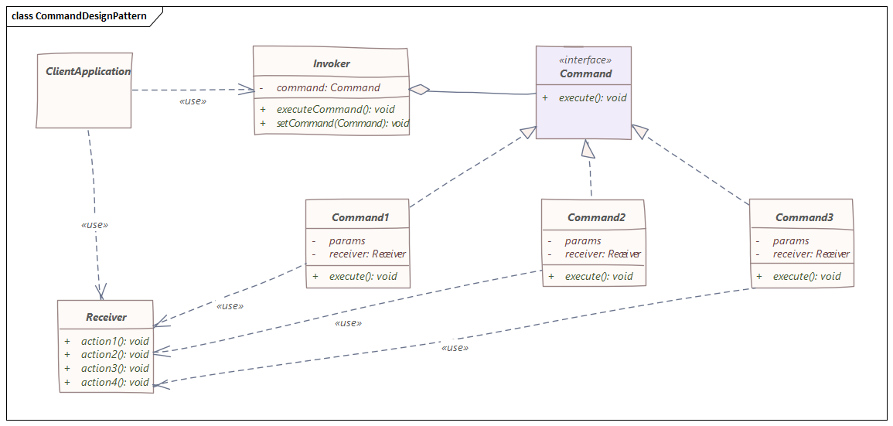

# 命令模式
> 命令模式是一种数据驱动的设计模式，属于行为模式类别

## 介绍
请求作为命令包装在对象下并传递给调用者对象。 Invoker 对象寻找可以处理该命令的适当对象并将该命令传递给执行该命令的相应对象。
## 实现

在命令设计模式中，我们将请求包装在一个命令对象中，以及执行另一个对象的操作所需的所有信息。

`Command`对象知道接收者并通过提供参数来调用接收者的方法，接收器方法的参数值存储在`Command`对象中。


`Receiver`对象在`Command`的`execute()`方法被调用时执行该作业。

我们将此`Command`对象传递给`Invoker`对象以执行`execute`方法，`Invoker`对象执行`Command`对象的方法并将所需的参数传递给它。

`Invoker`对象知道如何执行命令，但是，它对任何具体命令一无所知，它所知道的只是命令接口/抽象类。

`Invoker`可以随时获取不同的`Command`对象，因此`Client`只与`Invoker`打交道以对不同的对象执行操作。这些对象称为`Receiver`对象。

`Command`对象收集请求的所有详细信息并在`Receiver`上执行操作。

命令设计模式也支持可撤消的操作，我们可以有一种未执行的方法来将对象的状态返回到其原始状态。因此，该模式通过使用`Invoker`对象以简单的方式执行一系列工作/请求变得非常容易。

## 实例
假设我们正在构建一个家庭自动化系统。有一个可编程遥控器，可用于打开和关闭您家中的各种物品，如灯、音响、交流电等；

命令接口：
```java
// A simple Java program to demonstrate
// implementation of Command Pattern using
// a remote control example.

// An interface for command
public interface Command {
    void execute();
}
```

一些实体定义：
```java
// Light class and its corresponding command classes
public class Light {

    public void on() {
        System.out.println("Light is on");
    }

    public void off() {
        System.out.println("Light is off");
    }
}
```
```java
// Stereo and its command classes
public class Stereo {

    public void on() {
        System.out.println("Stereo is on");
    }

    public void off() {
        System.out.println("Stereo is off");
    }

    public void setCD() {
        System.out.println("Stereo is set " + "for CD input");
    }

    public void setDVD() {
        System.out.println("Stereo is set" + " for DVD input");
    }

    public void setRadio() {
        System.out.println("Stereo is set" + " for Radio");
    }

    public void setVolume(int volume) {
        // code to set the volume
        System.out.println("Stereo volume set" + " to " + volume);
    }
}
```

相关命令：
```java
public class LightOffCommand implements Command {

    Light light;

    public LightOffCommand(Light light) {
        this.light = light;
    }

    public void execute() {
        light.off();
    }
}
```
```java
public class LightOnCommand implements Command {

    Light light;

    // The constructor is passed the light it
    // is going to control.
    public LightOnCommand(Light light) {
        this.light = light;
    }

    public void execute() {
        light.on();
    }
}
```
```java
public class StereoOffCommand implements Command {

    Stereo stereo;

    public StereoOffCommand(Stereo stereo) {
        this.stereo = stereo;
    }

    public void execute() {
        stereo.off();
    }
}

```
```java
public class StereoOnWithCDCommand implements Command {
    Stereo stereo;

    public StereoOnWithCDCommand(Stereo stereo) {
        this.stereo = stereo;
    }

    public void execute() {
        stereo.on();
        stereo.setCD();
        stereo.setVolume(11);
    }
}
```

一个简单的一键遥控器：
```java
// A Simple remote control with one button
public class SimpleRemoteControl {

    Command slot;  // only one button

    public SimpleRemoteControl() {
    }

    public void setCommand(Command command) {
        // set the command the remote will
        // execute
        slot = command;
    }

    public void buttonWasPressed() {
        slot.execute();
    }
}
```

最后，我们编写测试类进行验证：
```java
public class Main {

    public static void main(String[] args) {
        SimpleRemoteControl remote = new SimpleRemoteControl();
        Light light = new Light();
        Stereo stereo = new Stereo();

        // we can change command dynamically
        remote.setCommand(new LightOnCommand(light));
        remote.buttonWasPressed();
        remote.setCommand(new StereoOnWithCDCommand(stereo));
        remote.buttonWasPressed();
        remote.setCommand(new StereoOffCommand(stereo));
        remote.buttonWasPressed();
    }
}
```

```
Light is on
Stereo is on
Stereo is set for CD input
Stereo volume set to 11
Stereo is off
```
## 结论
命令模式的好处在于：
- 使我们的代码可扩展，因为我们可以在不更改现有代码的情况下添加新命令
- 减少命令的调用者和接收者的耦合

缺点：
- 增加每个单独命令的类数

以上源代码已经上传至[Github](https://github.com/surzia/design-pattern)