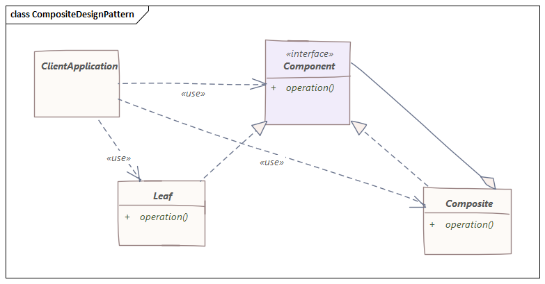

# 组合模式
> 螺丝加螺母，拧成一棵树

## 介绍
组合设计模式旨在“将对象组合成树结构来表示部分，即整体层次结构。组合模式让用户可以统一处理单个对象和对象的组合”。

当用户需要忽略对象的组合和单个对象之间的差异时，应该使用复合模式。

如果程序员发现他们以相同的方式使用多个对象，并且通常有几乎相同的代码来处理每个对象，那么组合是一个不错的选择。

## 结构
组合模式有四个模块：

- Component：组件声明组合中对象的接口以及用于访问和管理其子组件的接口。 它还根据需要为所有类通用的接口实现默认行为
- Leaf：叶定义组合中原始对象的行为。它代表组合中的叶对象
- Composite：Composite存储子组件并在组件接口中实现与子相关的操作
- Client：客户端通过组件接口操作组合中的对象

图示如下：


## 例子
假设我们正在开发一个系统，该系统将报告公司各部门的工资预算使用情况。每个部门都可以有子部门或雇员名单，其中包含有关其工资的信息。在这种情况下，部门是组合结构，员工是叶子。叶是没有更多嵌套元素的结构，让我们从为这两个元素定义一个基本接口开始：
```java
public interface Salary {

    int calculateSalary();

    String getName();
}
```
组合元素还必须能够添加相关部门和员工，因此需要拓展接口：
```java
public abstract class SalaryComposite implements Salary {

    public abstract void addDependent(Salary employee);
}
```
接下来就该定义部门的模型，它应该能够收集依赖结构并使用它们的接口来计算工资总额。
```java
public class Department extends SalaryComposite {

    public final List<Salary> dependencies;
    public final String name;

    public Department(String name) {
        this.dependencies = new ArrayList<>();
        this.name = name;
    }

    public String getName() {
        return name;
    }

    public List<Salary> getDependencies() {
        return dependencies;
    }

    @Override
    public void addDependent(Salary employee) {
        this.dependencies.add(employee);
    }

    @Override
    public int calculateSalary() {
        int total = 0;
        for (Salary dependency : this.dependencies) {
            total += dependency.calculateSalary();
        }
        return total;
    }
}
```
我们假设每个Employee都是独一无二的，不能同时在多个部门工作，我们现在必须对每个员工的行为进行建模，它应该只提供有关他的收入的信息。
```java
public class Employee implements Salary {

    private final String name;
    private final int salary;

    public Employee(String name, int salary) {
        this.name = name;
        this.salary = salary;
    }

    @Override
    public int calculateSalary() {
        return this.salary;
    }

    public String getName() {
        return name;
    }
}
```
最后，我们来进行测试，我们建立两个公司，BugMaker和Bit，两个公司是合作关系，其中BugMaker的部门结构采用组合模式来设计，我们可以测试上述系统是否可靠。
```java
public class Main {

    public static void main(String[] args) {
        Department company = new Department("BugMaker");

        SalaryComposite accounting = new Department("Accounting");
        Salary emmy = new Employee("Emmy", 5000);
        Salary emma = new Employee("Emma", 8000);
        accounting.addDependent(emmy);
        accounting.addDependent(emma);

        SalaryComposite it = new Department("IT");
        Salary joy = new Employee("Joy", 15000);
        Salary mike = new Employee("Mike", 20000);
        it.addDependent(joy);
        it.addDependent(mike);

        SalaryComposite friend = new Department("Bit");
        Salary bill = new Employee("Bill", 25000);
        friend.addDependent(bill);

        company.addDependent(accounting);
        company.addDependent(it);

        System.out.println("公司部门：");
        for (int i = 0; i < company.getDependencies().size(); i++) {
            System.out.println(company.getDependencies().get(i).getName());
        }
        System.out.println("公司所发薪资：");
        System.out.println(company.calculateSalary());
    }
}
```
输出结果：
```
公司部门：
Accounting
IT
公司所发薪资：
48000
```
可以看到，并没有算上合作公司的薪资，系统正确性可以保证。

## 结论
组合模式的好处在于对象更少减少了内存使用，并且它远离与内存相关的错误，如java.lang.OutOfMemoryError。

同时，尽管在Java中创建对象确实很快，但我们仍然可以通过共享对象来减少程序的执行时间。

当然了，组合模式也会有缺点，组合设计模式使得限制组合组件的类型变得更加困难。因此，当不想表示对象的完整或部分层次结构时，就不应使用它。

组合设计模式会使设计过于笼统，限制组合的组件变得更加困难。有时我们希望组合仅包含某些组件，但使用Composite不能依赖类型系统来为我们强制执行这些约束。相反，必须使用运行时检查。

源代码见[github](https://github.com/surzia/design-pattern)