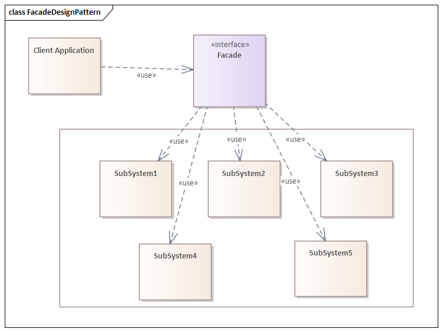
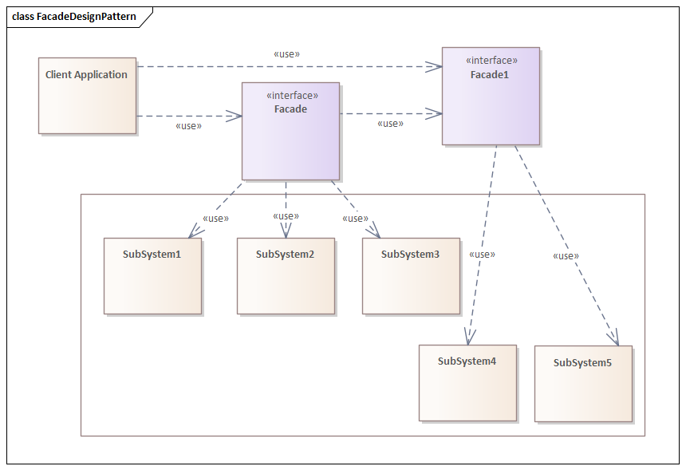

# 外观模式
> 外观模式让复杂的接口能够被简单操作，如名称所描述，只提供外观。

## 特性
外观模式通过掩盖复杂的基础系统来提供简单的用户接口，比如人们只能看到建筑物表面，对布线，管道和其他复杂性一无所知。外观掩盖了建筑物的所有复杂性，并显示出简单的面孔。

外观可以提供一组有限的或专用的功能，可以根据客户端需求提供更多服务。其结构图如下：


当然了，我们可能还会有多个Facade对象，一个对象处理几个子系统，另一个对象处理一些其他子系统。


## 例子
假如你是一个顾客，去便利店购物，到了结账的时候，你不必亲自记住自己买的所有物品每件单价是多少，你只需要走到收银台把买的东西交个收银员就行了。

对于便利店这样复杂的系统来说，收银员就是提供给外界的一个简单接口，顾客不必了解商品价格也能完成购物。

因此，首先需要定义一个结算接口，提供一个结算商品的方法。
```java
public interface Settlement {

    double settleAccounts();
}
```
便利店内所有的商品都会继承这个接口，返回自己的价格。
```java
public class Coca implements Settlement {

    private final int count;
    private final double price;

    public Coca(int count, double price) {
        this.count = count;
        this.price = price;
    }

    @Override
    public double settleAccounts() {
        return count * price;
    }
}
```
紧接着创建收银员实例以及结账方法，传入商品购物车返回总价格。
```java
public class Cashier {

    public double getCost(Settlement[] shopCart) {
        double cost = 0.0;
        for (Settlement good : shopCart) {
            cost += good.settleAccounts();
        }
        return cost;
    }
}
```
最后，我们来模拟这个场景。
```java
public class Main {

    public static void main(String[] args) {
        Coca coca = new Coca(2, 3.0);
        Bread bread = new Bread(3, 4.5);
        System.out.println("结账中...");
        Settlement[] shopCart = new Settlement[]{coca, bread};
        Cashier cashier = new Cashier();
        System.out.println("总共消费" + cashier.getCost(shopCart) + "元");
    }
}
```
输出
```
结账中...
总共消费19.5元
```

## 结论
当一个复杂的系统想要以简化的方式向客户端公开，或者想要在与该系统不兼容的现有系统上建立外部通信层时，应该采用外观设计模式。

外观只是处理接口而不是实现，其目的是将内部复杂性隐藏在单个接口中，而该接口在外部看起来很简单。

源代码见[github](https://github.com/surzia/design-pattern)