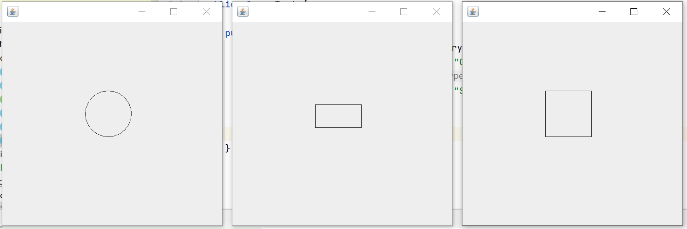
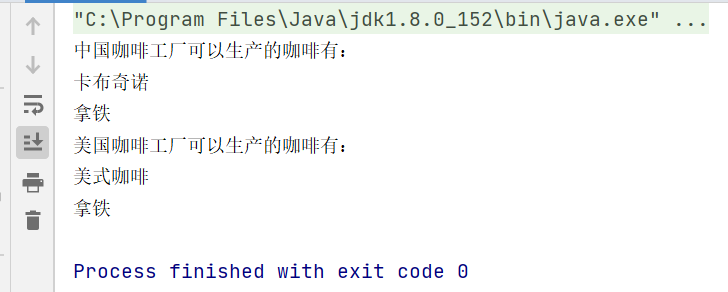
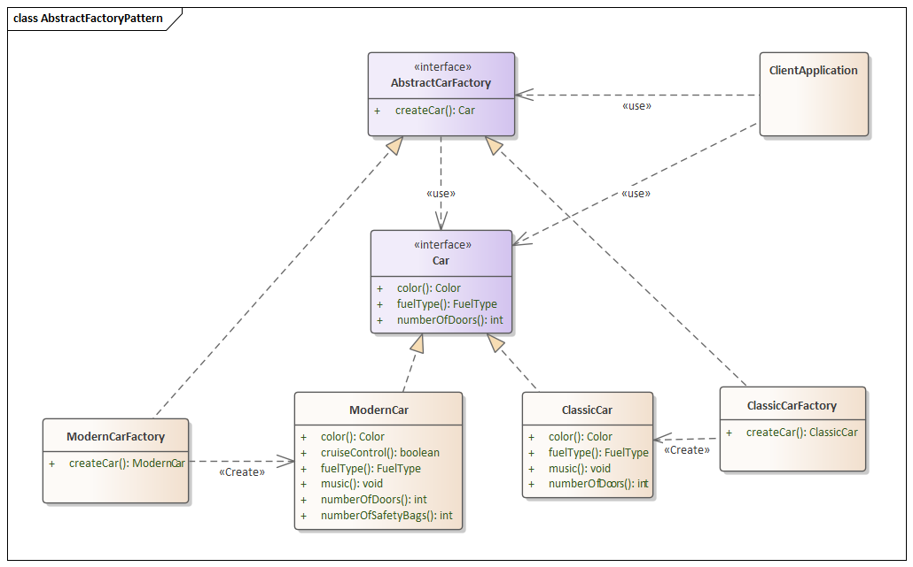
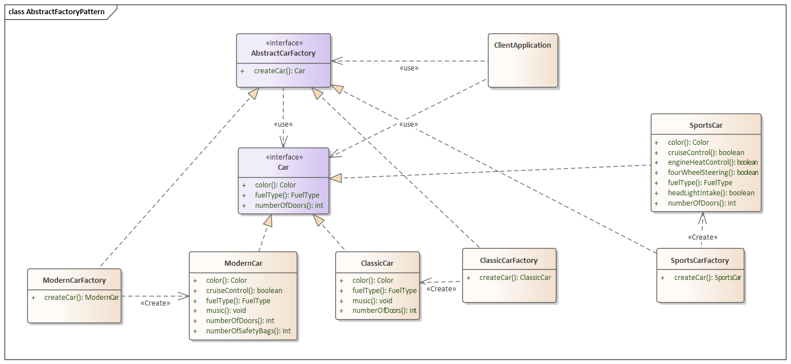
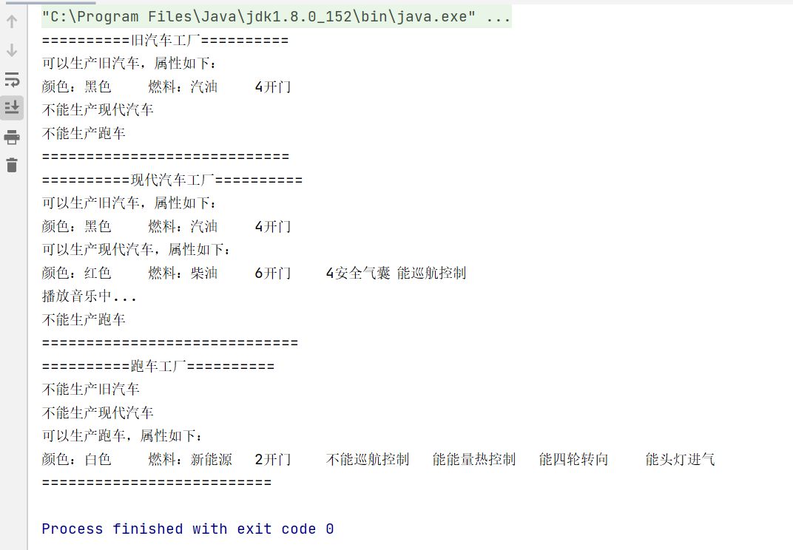

# 工厂模式

> 工厂模式是一种创建型的设计模式，它提供一个接口，让子类决定要实例化哪种对象，就如同名字所言，像一个加工厂，告诉它要什么就给你什么。

## 特性

- 使用工厂方法来处理创建对象的问题，而无需指定必须创建的对象的确切类
- 通过调用工厂方法而不是通过构造函数来创建对象
- 没有将创建逻辑暴露给客户端
- 工厂模式是Java中最常用的设计模式之一

## 实现

- 在接口内定义一个工厂方法
- 让子类实现上述工厂方法并确定要创建的对象

在Java中，虽然构造函数无法实现多态，但通过允许子类创建对象，实例化过程就有了多态行为，因此工厂方法也被称为**虚拟构造器**。

还是通过一个最简单的例子来了解工厂模式：

假如有一个简单图形加工厂，可以画圆、正方形和长方形，UML图类似如下：


首先，创建一个接口：

```java
public interface Shape {
    void draw();
}
```

创建实现相同接口的具体类。

```java
/**
 * 画圆
 */
public class Circle implements Shape {
    @Override
    public void draw() {
        JFrame frame = new JFrame();
        Swing swing = new Swing();
        frame.setVisible(true);
        frame.setBounds(200, 200, 500, 500);
        frame.setDefaultCloseOperation(JFrame.EXIT_ON_CLOSE);
        frame.add(swing);
    }

    static class Swing extends JPanel {
        @Override
        public void paint(Graphics g) {
            super.paint(g);
            g.drawOval(180, 150, 100, 100);
        }
    }
}
```

```java
/**
 * 画正方形
 */
public class Square implements Shape{
    @Override
    public void draw() {
        JFrame frame = new JFrame();
        Swing swing = new Swing();
        frame.setVisible(true);
        frame.setBounds(1200, 200, 500, 500);
        frame.setDefaultCloseOperation(JFrame.EXIT_ON_CLOSE);
        frame.add(swing);
    }

    static class Swing extends JPanel {
        @Override
        public void paint(Graphics g) {
            super.paint(g);
            g.drawRect(180, 150, 100, 100);
        }
    }
}
```

```java
/**
 * 画矩形
 */
public class Rectangle implements Shape {
    @Override
    public void draw() {
        JFrame frame = new JFrame();
        Swing swing = new Swing();
        frame.setVisible(true);
        frame.setBounds(700, 200, 500, 500);
        frame.setDefaultCloseOperation(JFrame.EXIT_ON_CLOSE);
        frame.add(swing);
    }

    static class Swing extends JPanel {
        @Override
        public void paint(Graphics g) {
            super.paint(g);
            g.drawRect(180, 180, 100, 50);
        }
    }
}
```

然后，创建一个工厂以根据给定的信息生成具体类的对象。

```java
public class ShapeFactory {
    public Shape getShape(String type) {
        switch (type) {
            case "CIRCLE":
                return new Circle();
            case "RECTANGLE":
                return new Rectangle();
            case "SQUARE":
                return new Square();
            default:
                return null;
        }
    }
}
```

使用工厂通过传递诸如类型之类的信息来获取具体类的对象。

```java
public class Test {
    public static void main(String[] args) {
        ShapeFactory factory = new ShapeFactory();
        Shape circle = factory.getShape("CIRCLE");
        Shape rectangle = factory.getShape("RECTANGLE");
        Shape square = factory.getShape("SQUARE");
        circle.draw();
        rectangle.draw();
        square.draw();
    }
}
```

最后我们验证一下结果：



## 三种模式

### 简单工厂模式

简单工厂实际不能算作一种设计模式，它引入了创建者的概念，将实例化的代码从应用代码中抽离，在创建者类的静态方法中只处理创建对象的细节，后续创建的实例如需改变，只需改造创建者类即可。

但由于使用静态方法来获取对象，使其不能在运行期间通过不同方式去动态改变创建行为，因此存在一定局限性。

上述画图工厂就是一个简单工厂例子。

### 工厂方法模式

由子类决定要实例化的类是哪一个，工厂方法让类把实例化推迟到了子类。

例子摘自[JAVA设计模式之工厂模式（三种工厂模式）-阿里云开发者社区](https://developer.aliyun.com/article/725085)

以制造coffee为例：

```java
public abstract class Coffee {
    public abstract String getName();
}
```

美式咖啡

```java
public class Americano extends Coffee {
    @Override
    public String getName() {
        return "美式咖啡";
    }
}
```

卡布奇诺

```java
public class Cappuccino extends Coffee {
    @Override
    public String getName() {
        return "卡布奇诺";
    }
}
```

拿铁

```java
public class Latte extends Coffee {
    @Override
    public String getName() {
        return "拿铁";
    }
}
```

不同地区咖啡工厂受制于环境、原料等因素的影响，制造出的咖啡种类有限。中国咖啡工厂仅能制造卡布奇诺、拿铁，而美国咖啡工厂仅能制造美式咖啡、拿铁。

咖啡工厂

```java
public abstract class CoffeeFactory {
    public abstract Coffee[] create();
}
```

中国工厂

```java
public class ChinaCoffeeFactory extends CoffeeFactory {
    @Override
    public Coffee[] create() {
        return new Coffee[]{new Cappuccino(), new Latte()};
    }
}
```

美国工厂

```java
public class AmericaCoffeeFactory extends CoffeeFactory {
    @Override
    public Coffee[] create() {
        return new Coffee[]{new Americano(), new Latte()};
    }
}
```

测试

```java
public class Test {
    static void print(Coffee[] coffee) {
        for (Coffee c : coffee) {
            System.out.println(c.getName());
        }
    }

    public static void main(String[] args) {
        CoffeeFactory chinaCoffeeFactory = new ChinaCoffeeFactory();
        Coffee[] chinaCoffees = chinaCoffeeFactory.create();
        System.out.println("中国咖啡工厂可以生产的咖啡有：");
        print(chinaCoffees);
        CoffeeFactory americaCoffeeFactory = new AmericaCoffeeFactory();
        Coffee[] americaCoffees = americaCoffeeFactory.create();
        System.out.println("美国咖啡工厂可以生产的咖啡有：");
        print(americaCoffees);
    }
}
```

输出



### 抽象工厂模式

提供一个接口，用于创建相关或依赖对象的家族，而不需要明确指定具体类。再来看一个例子：

有一家汽车厂已经有很长时间了。因此，它有一个名为ClassicCarFactory的旧汽车工厂。后来，该公司开始制造一些新的现代汽车，因此开了另一个工厂，名为ModernCarFactory。因此，为此，我们将AbtractCarFactory用作抽象工厂设计模式。这样，我们将确保客户端上没有任何更改或更改最少。 



假设由于现代汽车的成功，该公司决定也开始制造跑车，并为此开设了另一家工厂，使用相同的样式进行如下设计。



首先，创建一个抽象工厂

```java
public interface AbstractCarFactory {
    ClassicCar createClassicCar();
    ModernCar createModernCar();
    SportsCar createSportsCar();
}
```

在这个抽象工厂里，提供了创建三种车的接口，这三种车都有一些共同属性，因此再定义一个车的接口

```java
public interface Car {
    // 颜色
    Color color();
    // 燃料
    Fuel fuel();
    // 几开门
    int doors();
}
```

其中颜色和燃料可以用枚举来表示

```java
public enum Color {
    BLACK("黑色"),
    BLUE("蓝色"),
    GREEN("绿色"),
    RED("红色"),
    WHITE("白色"),
    YELLOW("黄色");

    private final String name;

    Color(String color) {
        this.name = color;
    }

    public String getName() {
        return name;
    }
}
```

```java
public enum Fuel {
    GASOLINE("汽油"),
    DIESEL("柴油"),
    ENERGY("新能源");

    private final String name;

    Fuel(String fuel) {
        this.name = fuel;
    }

    public String getName() {
        return name;
    }
}
```

接下来，定义三种具体的车型，这些车型全都继承车的接口，并且有的车型还有独特的属性

```java
public class ClassicCar implements Car {

    @Override
    public Color color() {
        return Color.BLACK;
    }

    @Override
    public Fuel fuel() {
        return Fuel.GASOLINE;
    }

    @Override
    public int doors() {
        return 4;
    }

    @Override
    public String toString() {
        return "可以生产旧汽车，属性如下：\n" +
                "颜色：" + color().getName() +
                "\t" +
                "燃料：" + fuel().getName() +
                "\t" +
                doors() + "开门";
    }
}
```

```java
public class ModernCar implements Car {

    @Override
    public Color color() {
        return Color.RED;
    }

    @Override
    public Fuel fuel() {
        return Fuel.DIESEL;
    }

    @Override
    public int doors() {
        return 6;
    }

    public int safetyBags() {
        return 4;
    }

    public boolean cruiseControl() {
        return true;
    }

    public void music() {
        System.out.println("播放音乐中...");
    }

    @Override
    public String toString() {
        String cruise;
        if (cruiseControl()) cruise = "能";
        else cruise = "不能";
        return "可以生产现代汽车，属性如下：\n" +
                "颜色：" + color().getName() +
                "\t" +
                "燃料：" + fuel().getName() +
                "\t" +
                doors() + "开门" +
                "\t" +
                safetyBags() + "安全气囊" +
                "\t" +
                cruise + "巡航控制";
    }
}
```

```java
public class SportsCar implements Car {

    @Override
    public Color color() {
        return Color.WHITE;
    }

    @Override
    public Fuel fuel() {
        return Fuel.ENERGY;
    }

    @Override
    public int doors() {
        return 2;
    }

    public boolean cruiseControl() {
        return false;
    }

    public boolean energyHeatControl() {
        return true;
    }

    public boolean fourWheelSteering() {
        return true;
    }

    public boolean headLightIntake() {
        return true;
    }

    @Override
    public String toString() {
        String cruise;
        String energy;
        String wheel;
        String head;
        if (cruiseControl()) cruise = "能";
        else cruise = "不能";
        if (energyHeatControl()) energy = "能";
        else energy = "不能";
        if (fourWheelSteering()) wheel = "能";
        else wheel = "不能";
        if (headLightIntake()) head = "能";
        else head = "不能";
        return "可以生产跑车，属性如下：\n" +
                "颜色：" + color().getName() +
                "\t" +
                "燃料：" + fuel().getName() +
                "\t" +
                doors() + "开门" +
                "\t" +
                cruise + "巡航控制" +
                "\t" +
                energy + "能量热控制" +
                "\t" +
                wheel + "四轮转向" +
                "\t" +
                head + "头灯进气";
    }
}
```

接下来，就要开始构造生产三种车的工厂了，这里定义以下的逻辑：旧汽车工厂只能生产旧汽车，现代汽车工厂可以生产旧汽车和现代汽车，而跑车工厂由于独特性，也只能生产跑车。

```java
public class ClassicCarFactory implements AbstractCarFactory {

    @Override
    public ClassicCar createClassicCar() {
        return new ClassicCar();
    }

    @Override
    public ModernCar createModernCar() {
        return null;
    }

    @Override
    public SportsCar createSportsCar() {
        return null;
    }
}
```

```java
public class ModernCarFactory implements AbstractCarFactory {

    @Override
    public ClassicCar createClassicCar() {
        return new ClassicCar();
    }

    @Override
    public ModernCar createModernCar() {
        return new ModernCar();
    }

    @Override
    public SportsCar createSportsCar() {
        return null;
    }
}
```

```java
public class SportsCarFactory implements AbstractCarFactory {

    @Override
    public ClassicCar createClassicCar() {
        return null;
    }

    @Override
    public ModernCar createModernCar() {
        return null;
    }

    @Override
    public SportsCar createSportsCar() {
        return new SportsCar();
    }
}
```

最后，添加测试类

```java
public class Test {

    public static void main(String[] args) {
        AbstractCarFactory classicCarFactory = new ClassicCarFactory();
        AbstractCarFactory modernCarFactory = new ModernCarFactory();
        AbstractCarFactory sportsCarFactory = new SportsCarFactory();
        System.out.println("==========旧汽车工厂==========");
        print(classicCarFactory);
        System.out.println("============================");
        System.out.println("==========现代汽车工厂==========");
        print(modernCarFactory);
        System.out.println("=============================");
        System.out.println("==========跑车工厂==========");
        print(sportsCarFactory);
        System.out.println("==========================");
    }

    private static void print(AbstractCarFactory carFactory) {
        ClassicCar classicCar;
        ModernCar modernCar;
        SportsCar sportsCar;
        classicCar = carFactory.createClassicCar();
        if (classicCar == null) {
            System.out.println("不能生产旧汽车");
        } else {
            System.out.println(classicCar.toString());
        }
        modernCar = carFactory.createModernCar();
        if (modernCar == null) {
            System.out.println("不能生产现代汽车");
        } else {
            System.out.println(modernCar.toString());
            modernCar.music();
        }
        sportsCar = carFactory.createSportsCar();
        if (sportsCar == null) {
            System.out.println("不能生产跑车");
        } else {
            System.out.println(sportsCar.toString());
        }
    }
}
```

启动来验证效果：



## 总结

简单工厂：不能算是真正意义上的设计模式，但可以将客户程序从具体类解耦。

工厂方法：使用继承，把对象的创建委托给子类，由子类来实现创建方法，可以看作是抽象工厂模式中只有单一产品的情况。

抽象工厂：使对象的创建被实现在工厂接口所暴露出来的方法中。

以上源代码已经上传至[Github](https://github.com/surzia/design-pattern)