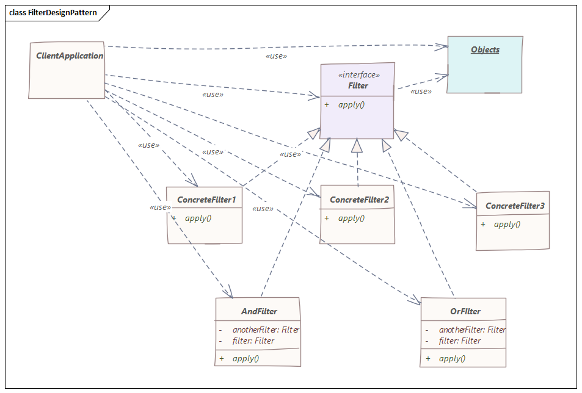

# 过滤器模式

> 使开发人员能够使用不同的标准过滤一组对象，并通过逻辑操作以解耦的方式将它们链接起来。

## 介绍


- 创建要应用`filter`的类
- 为`filter`创建一个接口
- 创建实现`filter`接口的具体类
- 使用不同的标准及其组合来过滤
- 验证输出

## 实现

我们将创建一个Person对象、Criteria接口和实现该接口的具体类来过滤Person对象列表，我们的演示类使用Criteria对象根据各种条件及其组合过滤Person对象列表。

创建要应用`filter`的类：
```java
public class Person {

    private String name;
    private String gender;
    private String maritalStatus;

    public Person(String name, String gender, String maritalStatus){
        this.name = name;
        this.gender = gender;
        this.maritalStatus = maritalStatus;
    }

    public String getName() {
        return name;
    }
    public String getGender() {
        return gender;
    }
    public String getMaritalStatus() {
        return maritalStatus;
    }
}
```

为`filter`创建一个接口：

```java
import java.util.List;

public interface Criteria {
    List<Person> meetCriteria(List<Person> persons);
}
```

创建实现`filter`接口的具体类：
```java
import java.util.ArrayList;
import java.util.List;

public class CriteriaMale implements Criteria {

    @Override
    public List<Person> meetCriteria(List<Person> persons) {
        List<Person> malePersons = new ArrayList<Person>();

        for (Person person : persons) {
            if(person.getGender().equalsIgnoreCase("MALE")){
                malePersons.add(person);
            }
        }
        return malePersons;
    }
}
```

使用不同的标准及其组合来过滤：
```java
import java.util.ArrayList;
import java.util.List;

public class Main {

    public static void main(String[] args) {
        // Creating an object of List in main() method
        // Declaring object of user-defined datatype 'Person'
        List<Person> persons = new ArrayList<Person>();

        // Adding elements to the object created above
        // using the add() method of List
        // Custom entries
        persons.add(new Person("Robert","Male", "Single"));
        persons.add(new Person("John", "Male", "Married"));
        persons.add(new Person("Laura", "Female", "Married"));
        persons.add(new Person("Diana", "Female", "Single"));
        persons.add(new Person("Mike", "Male", "Single"));
        persons.add(new Person("Bobby", "Male", "Single"));

        Criteria male = new CriteriaMale();
        Criteria female = new CriteriaFemale();
        Criteria single = new CriteriaSingle();
        Criteria singleMale = new AndCriteria(single, male);
        Criteria singleOrFemale = new OrCriteria(single, female);

        // Display message
        System.out.println("Males: ");
        printPersons(male.meetCriteria(persons));

        // Display message
        System.out.println("\nFemales: ");
        printPersons(female.meetCriteria(persons));

        // Display message
        System.out.println("\nSingle Males: ");
        printPersons(singleMale.meetCriteria(persons));

        // Display message
        System.out.println("\nSingle Or Females: ");
        printPersons(singleOrFemale.meetCriteria(persons));
    }

    public static void printPersons(List<Person> persons){

        for (Person person : persons) {
            System.out.println("Person : [ Name : " + person.getName() + ", Gender : " + person.getGender() + ", Marital Status : " + person.getMaritalStatus() + " ]");
        }
    }
}

```

最后我们验证一下结果：
```
Males: 
Person : [ Name : Robert, Gender : Male, Marital Status : Single ]
Person : [ Name : John, Gender : Male, Marital Status : Married ]
Person : [ Name : Mike, Gender : Male, Marital Status : Single ]
Person : [ Name : Bobby, Gender : Male, Marital Status : Single ]

Females: 
Person : [ Name : Laura, Gender : Female, Marital Status : Married ]
Person : [ Name : Diana, Gender : Female, Marital Status : Single ]

Single Males: 
Person : [ Name : Robert, Gender : Male, Marital Status : Single ]
Person : [ Name : Mike, Gender : Male, Marital Status : Single ]
Person : [ Name : Bobby, Gender : Male, Marital Status : Single ]

Single Or Females: 
Person : [ Name : Robert, Gender : Male, Marital Status : Single ]
Person : [ Name : Diana, Gender : Female, Marital Status : Single ]
Person : [ Name : Mike, Gender : Male, Marital Status : Single ]
Person : [ Name : Bobby, Gender : Male, Marital Status : Single ]
Person : [ Name : Laura, Gender : Female, Marital Status : Married ]
```

## 总结

以上源代码已经上传至[Github](https://github.com/surzia/design-pattern)