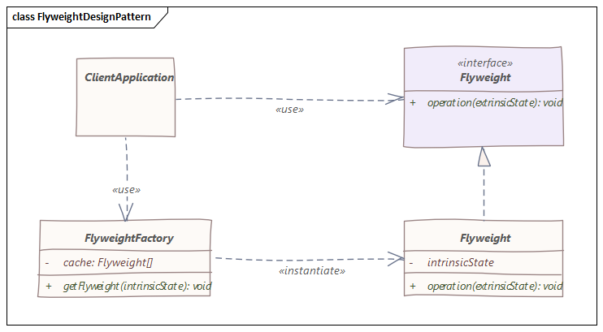

# 享元模式
> 此模式用于减少内存占用，还可以提高对象实例化成本高昂的应用程序的性能

## 介绍
简单地说，享元模式基于一个工厂，它通过在创建后存储对象来回收创建的对象。每次请求一个对象时，工厂都会查找该对象以检查它是否已经被创建。如果是，则返回现有对象，否则，创建、存储并返回一个新对象。

享元对象是不可变的，这一点非常重要：对状态的任何操作都必须由工厂执行。

## 实现
享元模式图解如下：

该模式的主要组成是：

- 定义客户端代码可以对享元对象执行的操作的接口
- 上述接口的一个或多个具体实现
- 处理对象实例化和缓存的工厂

## 实例
下面通过一个汽车工厂案例来说明。

首先，我们将创建一个Vehicle接口。
```java
public interface Vehicle {

    void start();

    void stop();

    Color getColor();
}
```
接下来，让我们将Car类实现Vehicle接口。我们的汽车将实现Vehicle接口的所有方法，至于它的状态，它将有一个引擎和一个颜色字段：
```java
public class Car implements Vehicle {

    private final Engine engine;

    private final Color color;

    public Car(Engine engine, Color color) {
        this.engine = engine;
        this.color = color;

        try {
            Thread.sleep(2000);
        } catch (InterruptedException e) {
            e.printStackTrace();
        }
    }

    @Override
    public void start() {
        System.out.println("汽车启动中...");
        engine.start();
    }

    @Override
    public void stop() {
        System.out.println("汽车熄火");
        engine.stop();
    }

    @Override
    public Color getColor() {
        return this.color;
    }
}
```
最后，我们将创建VehicleFactory。制造一辆新车是一项非常昂贵的操作，因此工厂只会为每种颜色制造一辆汽车。

为此，我们使用Map作为简单缓存来跟踪创建的车辆：
```java
public class VehicleFactory {

    private static final Map<Color, Vehicle> vehicleCache = new HashMap<>();

    public static Vehicle create(Color color) {
        return vehicleCache.computeIfAbsent(color, color1 -> {
            Engine newEngine = new Engine();
            return new Car(newEngine, color1);
        });
    }
}
```

## 使用场景
### 数据压缩
享元模式的目标是通过共享尽可能多的数据来减少内存使用，因此，它是无损压缩算法的良好基础。 在这种情况下，每个享元对象充当一个指针，其外部状态是上下文相关信息。

这种用法的一个典型例子是在文字处理器中。在这里，每个角色都是一个享元对象，它共享渲染所需的数据。结果，只有字符在文档中的位置会占用额外的内存。

### 数据缓存
许多现代应用程序使用缓存来缩短响应时间。享元模式类似于缓存的核心概念，可以很好地满足这一目的。

当然，此模式与典型的通用缓存在复杂性和实现方面存在一些关键差异。

## 结论
以上源代码已经上传至[Github](https://github.com/surzia/design-pattern)