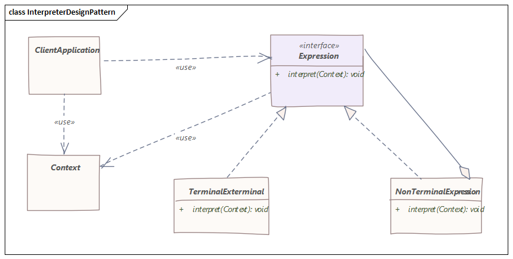

# 解释器模式
> 用于定义一种语言的语法表示，并提供一个解释器来处理这种语法

## 介绍
简而言之，该模式以面向对象的方式定义了特定语言的语法，解释器本身可以对其进行评估。

考虑到这一点，从技术上讲，我们可以构建自定义正则表达式、自定义DSL解释器，或者我们可以解析任何人类语言，构建抽象语法树，然后运行解释。

这些只是一些潜在的用例，但如果我们想一想，我们会发现它的更多用途，例如在我们的IDE中，因为它们不断解释我们正在编写的代码，从而为我们提供智能提示。

当语法比较简单时，一般应该使用解释器模式。反之，它可能会变得难以维护。

## 实现
解释器模式图解如下：

上图显示了两个主要实体：`Context`和`Expression`。

任何语言都需要以某种方式表达，并且单词（表达）将根据给定的上下文具有某种含义。

`AbstractExpression`定义了一种将上下文作为参数的抽象方法。每个表达式都会影响上下文，改变它的状态，要么继续解释，要么返回结果本身。

因此，上下文将成为全局处理状态的持有者，并且将在整个解释过程中被重复使用。

那么`TerminalExpression`和`NonTerminalExpression`有什么区别呢？

一个`NonTerminalExpression`可能有一个或多个与之关联的其他`AbstractExpression`，因此它可以被递归解释。最后，解释过程必须以一个返回结果的`TerminalExpression`结束。

值得注意的是`NonTerminalExpression`是一个组合。

最后，客户端的作用是创建或使用已经创建的抽象语法树，它只不过是用创建的语言定义的一个句子。

## 实例
为了展示实际的模式，我们将以面向对象的方式构建一个简单的类似`SQL`的语法，然后将其解释并返回给我们结果。

首先，我们将定义`Select`、`From`和`Where`表达式，在客户端类中构建语法树并运行解释。

`Expression`接口将具有解释方法：
```java
public interface Expression {

    List<String> interpret(Context ctx);
}
```
接下来，我们定义第一个表达式，`Select`类：
```java
public class Select implements Expression {

    private final String column;
    private final From from;

    Select(String column, From from) {
        this.column = column;
        this.from = from;
    }

    @Override
    public List<String> interpret(Context ctx) {
        ctx.setColumn(column);
        return from.interpret(ctx);
    }
}
```
它获取要选择的列名和另一个`From`类型的具体表达式作为构造函数中的参数。

注意，在重写的`interpret()`方法中，它设置上下文的状态并将解释与上下文一起进一步传递给另一个表达式。

这样，我们看到它是一个`NonTerminalExpression`。

另一个表达式是`From`类：
```java
public class From implements Expression {

    private final String table;
    private Where where;

    From(String table) {
        this.table = table;
    }

    From(String table, Where where) {
        this.table = table;
        this.where = where;
    }

    @Override
    public List<String> interpret(Context ctx) {
        ctx.setTable(table);
        if (where == null) {
            return ctx.search();
        }
        return where.interpret(ctx);
    }
}
```

现在，在`SQL`中`where`子句是可选的，因此此类是终端或非终端表达式。

如果用户决定不使用`where`子句，`From`表达式将被`ctx.search()`调用终止并返回结果。否则，它将被进一步解释。

`Where`表达式再次通过设置必要的过滤器来修改上下文，并通过搜索调用终止解释：
```java
public class Where implements Expression {

    private final Predicate<String> filter;

    Where(Predicate<String> filter) {
        this.filter = filter;
    }

    @Override
    public List<String> interpret(Context ctx) {
        ctx.setFilter(filter);
        return ctx.search();
    }
}
```

例如，`Context`类保存模拟数据库表的数据。

请注意，它具有三个关键字段，由`Expression`的每个子类和搜索方法修改：
```java
public class Context {

    private static final Map<String, List<Row>> tables = new HashMap<>();

    static {
        List<Row> list = new ArrayList<>();
        list.add(new Row("John", "Doe"));
        list.add(new Row("Jan", "Kowalski"));
        list.add(new Row("Dominic", "Doom"));

        tables.put("people", list);
    }

    private String table;
    private String column;
    private Predicate<String> whereFilter;
    
    //...
    
    List<String> search() {

        List<String> result = tables.entrySet()
                .stream()
                .filter(entry -> entry.getKey().equalsIgnoreCase(table))
                .flatMap(entry -> Stream.of(entry.getValue()))
                .flatMap(Collection::stream)
                .map(Row::toString)
                .flatMap(columnMapper)
                .filter(whereFilter)
                .collect(Collectors.toList());

        clear();

        return result;
    }
}
```
搜索完成后，上下文会自行清除，因此列、表和过滤器设置为默认值，这样每个解释都不会影响另一个。

我们来测试一下结果：
```java
public class Main {

    public static void main(String[] args) {

        Expression query = new Select("name", new From("people"));
        Context ctx = new Context();
        List<String> result = query.interpret(ctx);
        System.out.println(result);

        Expression query2 = new Select("*", new From("people"));
        List<String> result2 = query2.interpret(ctx);
        System.out.println(result2);

        Expression query3 = new Select("name", new From("people", new Where(name -> name.toLowerCase().startsWith("d"))));
        List<String> result3 = query3.interpret(ctx);
        System.out.println(result3);
    }
}
```

运行结果：
```
[John, Jan, Dominic]
[John Doe, Jan Kowalski, Dominic Doom]
[Dominic]
```
## 结论
解释器设计模式非常适合相对简单的语法解释，不需要太多的发展和扩展。

以上源代码已经上传至[Github](https://github.com/surzia/design-pattern)