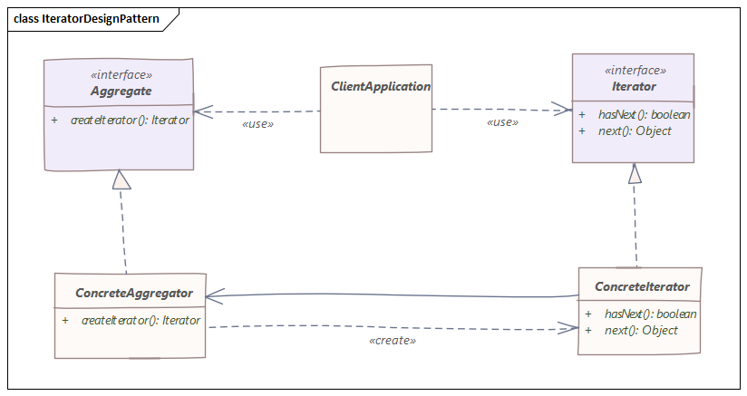

# 迭代器模式
> 此模式用于获得一种以顺序方式访问集合对象的元素的方法，而无需知道其底层表示

## 介绍
迭代器模式是一种相对简单且经常使用的设计模式。

每种语言都有很多数据结构/集合，每个集合都必须提供一个迭代器，让它遍历其对象。

然而，在这样做的同时，它应该确保它不会暴露它的实现。

## 实现

在这里，我们为客户端提供了一个通用接口`Aggregate`，因为它将它与对象集合的实现分离。

`ConcreteAggregator`实现了`createIterator()`，它为其集合返回迭代器。

每个`ConcreteAggregator`的职责是实例化一个可以迭代其对象集合的`ConcreteIterator`。

迭代器接口提供了一组遍历或修改集合的方法，除了`next()/hasNext()`之外，它还可以提供搜索、删除等功能。
## 实例
我们将创建一个`Iterator`接口和一个重新运行`iterator`的`Container`接口。

实现`Container`接口的具体类将负责实现`Iterator`接口并使用它。

我们的演示类将使用`NamesRepository`，这是一个具体的类实现，用于打印存储为`NamesRepository`中的集合的名称。

创建接口：
```java
public interface Iterator {

    boolean hasNext();
    Object next();
}
```
```java
public interface Container {
    Iterator getIterator();
}
```
创建实现`Container`接口的具体类。此类具有实现`Iterator`接口的内部类`NameIterator`。
```java
public class NameRepository implements Container {

    public String[] names = {"Robert", "John", "Julie", "Lora"};

    @Override
    public Iterator getIterator() {
        return new NameIterator();
    }

    private class NameIterator implements Iterator {

        int index;

        @Override
        public boolean hasNext() {
            return index < names.length;
        }

        @Override
        public Object next() {
            if (this.hasNext()) {
                return names[index++];
            }
            return null;
        }
    }
}
```
使用 NameRepository 获取迭代器和打印名称：
```java
public class Main {

    public static void main(String[] args) {
        NameRepository namesRepository = new NameRepository();

        for (Iterator iter = namesRepository.getIterator(); iter.hasNext(); ) {
            String name = (String) iter.next();
            System.out.println("Name : " + name);
        }
    }
}
```

输出将是这样的：
```
Name : Robert
Name : John
Name : Julie
Name : Lora
```

## 结论
以上源代码已经上传至[Github](https://github.com/surzia/design-pattern)