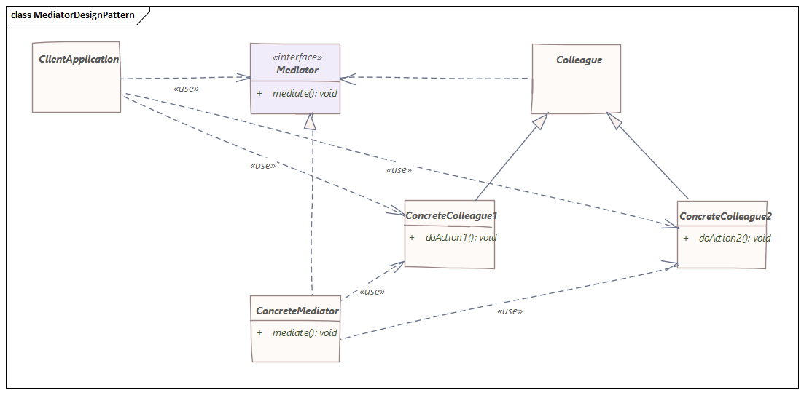

# 中介者模式
> 通过在中间引入一个层来实现对象的解耦，以便对象之间的交互通过该层发生

## 介绍
在面向对象编程中，我们应该始终尝试以组件松散耦合和可重用的方式设计系统，使我们的代码更易于维护和测试。

然而，在现实生活中，我们经常需要处理一组复杂的依赖对象，这时中介者模式可能会派上用场。

中介者模式的目的是减少紧密耦合的对象之间直接相互通信的复杂性和依赖性，这是通过创建一个处理依赖对象之间交互的中介对象来实现的，因此，所有的通信都通过中介。

这促进了松散耦合，因为一组一起工作的组件不再需要直接交互。相反，它们只引用单个中介对象。这样，也更容易在系统的其他部分重用这些对象。

## 实现
中介者模式图解如下：

在上图中，我们可以看到：

- `Mediator`定义了`Colleague`对象用来通信的接口
- `Colleague`定义了持有对`Mediator`的单个引用的抽象类
- `ConcreteMediator`封装了`Colleague`对象之间的交互逻辑
- `ConcreteColleague1`和`ConcreteColleague2`仅通过`Mediator`进行通信

正如我们所见，`Colleague`对象并不直接相互引用。相反，所有的通信都是由Mediator执行的。

因此，`ConcreteColleague1`和`ConcreteColleague2`可以更容易地重用。

此外，如果我们需要改变`Colleague`对象协同工作的方式，我们只需要修改`ConcreteMediator`逻辑，或者我们可以创建`Mediator`的新实现。
## 实例
想象一下，我们正在构建一个由风扇、电源和按钮组成的简单冷却系统。按下按钮将打开或关闭风扇，在我们打开风扇之前，我们需要打开电源。同样，我们必须在关闭风扇后立即关闭电源。

现在让我们看一下示例实现：
```java
public class Button {
    private Fan fan;

    // constructor, getters and setters

    public void press(){
        if(fan.isOn()){
            fan.turnOff();
        } else {
            fan.turnOn();
        }
    }
}
```
```java
public class Fan {
    private Button button;
    private PowerSupplier powerSupplier;
    private boolean isOn = false;

    // constructor, getters and setters

    public void turnOn() {
        powerSupplier.turnOn();
        isOn = true;
    }

    public void turnOff() {
        isOn = false;
        powerSupplier.turnOff();
    }
}
```
```java
public class PowerSupplier {
    public void turnOn() {
        // implementation
    }

    public void turnOff() {
        // implementation
    }
}
```
但请注意`Button`、`Fan`和`PowerSupplier`类是如何紧密耦合的。`Button`直接在`Fan`上运行，`Fan`与`Button`和`PowerSupplier`交互。

在其他模块中重用`Button`类会很困难。此外，如果我们需要在系统中添加第二个电源，那么我们将不得不修改`Fan`类的逻辑。

现在，让我们实现中介者模式来减少我们类之间的依赖关系，并使代码更具可重用性。

首先，我们来介绍一下`Mediator`类：
```java
public class Mediator {
    private Button button;
    private Fan fan;
    private PowerSupplier powerSupplier;

    // constructor, getters and setters

    public void press() {
        if (fan.isOn()) {
            fan.turnOff();
        } else {
            fan.turnOn();
        }
    }

    public void start() {
        powerSupplier.turnOn();
    }

    public void stop() {
        powerSupplier.turnOff();
    }
}
```
接下来，让我们修改剩下的类：
```java
public class Button {
    private Mediator mediator;

    // constructor, getters and setters

    public void press() {
        mediator.press();
    }
}
```
```java
public class Fan {
    private Mediator mediator;
    private boolean isOn = false;

    // constructor, getters and setters

    public void turnOn() {
        mediator.start();
        isOn = true;
    }

    public void turnOff() {
        isOn = false;
        mediator.stop();
    }
}
```
现在我们已经实现了中介者模式，`Button`、`Fan`或`PowerSupplier`类都没有直接通信，它们只有一个对调解器的引用。

如果以后需要添加第二个电源，我们只需要更新`Mediator`的逻辑即可；`Button`和`Fan`类保持不变。

这个例子展示了我们可以多么容易地分离依赖对象并使我们的系统更容易维护。

## 结论
如果我们必须处理一组紧密耦合且难以维护的对象，中介者模式是一个不错的选择，这样我们可以减少对象之间的依赖关系并降低整体复杂性。

此外，通过使用中介对象，我们将通信逻辑提取到单个组件，因此我们遵循单一责任原则。此外，我们可以引入新的中介，而无需更改系统的其余部分，因此，我们遵循开闭原则。

但是，有时由于系统设计错误，我们可能有太多紧密耦合的对象。如果是这种情况，我们不应该应用中介者模式；相反，我们应该退后一步，重新思考我们为类建模的方式。

与所有其他模式一样，在盲目实施中介者模式之前，我们需要考虑我们的特定用例。

以上源代码已经上传至[Github](https://github.com/surzia/design-pattern)