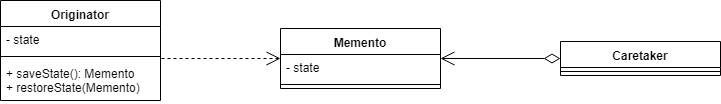

# 备忘录模式
> 备忘录设计模式提供了一种实现可撤销操作的解决方案

## 介绍
在该设计模式下，我们可以通过在给定时刻保存对象的状态并在需要撤消执行的操作时恢复它来做到这一点。

实际上，需要保存状态的对象称为Originator。Caretaker是触发状态保存和恢复的对象，称为Memento。

Memento对象应该向Caretaker公开尽可能少的信息。这是为了确保我们不会将Originator的内部状态暴露给外部世界，因为它会破坏封装原则。但是，发起者应该访问足够的信息以恢复到原始状态。

让我们看一个类图，说明不同的对象如何相互交互：

正如我们所见，Originator可以生产和消费Memento。同时，Caretaker只会在恢复状态之前保持状态。Originator的内部表示对外部是隐藏的。

在这里，我们使用了一个字段来表示Originator的状态，不过我们不限于一个字段，并且可以根据需要使用尽可能多的字段。另外，Memento对象中保存的状态不必与Originator的完整状态相匹配，只要保留的信息足以恢复Originator的状态，我们就可以开始了。

## 优缺点
###优点
我们可以使用序列化来实现更通用的备忘录模式实现，而不是每个对象都需要拥有自己的备忘录类实现的备忘录模式。

###缺点
如果Originator对象非常大，那么Memento对象也将非常大并使用大量内存。

## 总结
通常，备忘录设计模式将用于某些操作不可撤销的情况，因此需要回滚到以前的状态。但是，如果Originator的状态很重，则使用Memento设计模式可能会导致昂贵的创建过程和内存使用量的增加。

以上源代码已经上传至[Github](https://github.com/surzia/design-pattern)