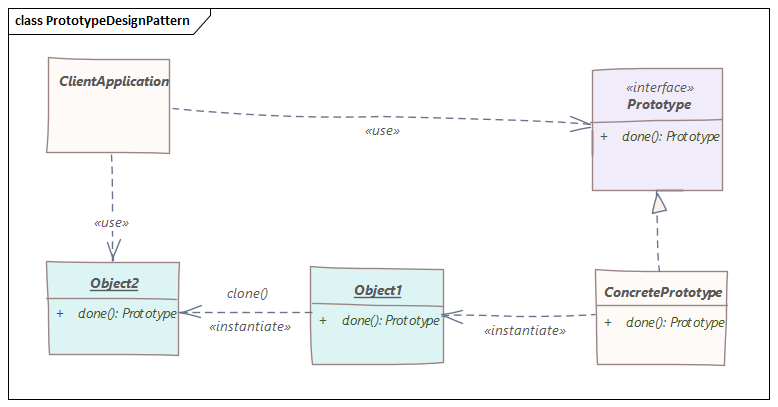
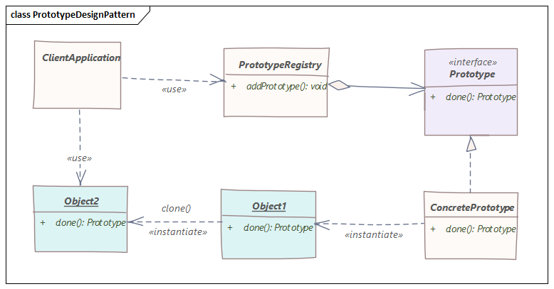

# 原型模式
> 对象创建会重复操作？定义一个原型就能解决问题。

## 原型模式特征
- 新创建？深拷贝？
- 一个类创建多个实例，每个实例状态相同差异很小
- 能用抄解决的事，为什么要造轮子呢？

## 深拷贝与浅拷贝
- **深拷贝**：通过复制原始对象的所有字段来创建对象。而且，如果原始对象包含其他对象作为字段，我们也将其复制。
- **浅拷贝**：通过复制原始对象的所有字段来创建对象。但是，如果原始对象包含其他对象作为字段，我们将仅复制这些对象的引用，而不是复制完整的对象本身。

## 原型模式实现
- 基本实现
  
- 原型注册
  
