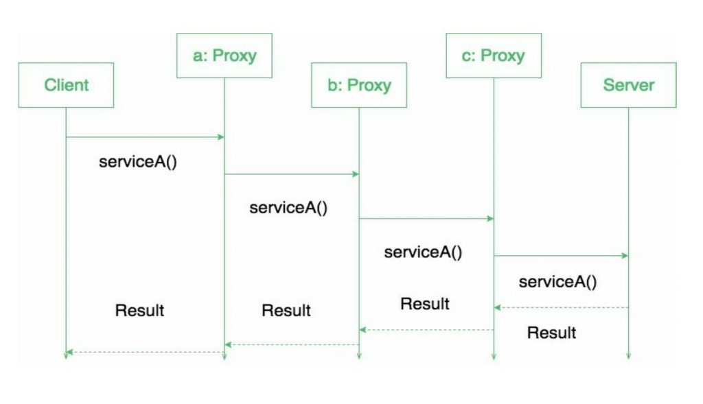

# 代理模式
> 老板不干活，小弟跑断腿，这就是一种代理模式

## 特性

- 代理设计模式提供了一种创建代表另一个类功能的类的方法。
- 代理可以连接任何东西。网络连接，内存中的大对象，文件或其他昂贵或无法复制的资源。
- 代理就像一个包装对象，客户端正在调用该包装对象以访问幕后的真实服务对象。
- 代理最常用于对象的延迟加载的实现中。
- ......

## 解释
现实世界中的例子可以是支票，也可以使用信用卡代替我们银行账户中的内容。它可以代替现金，并在需要时提供一种获取现金的方法。而这正是代理模式的作用：“**控制和管理对其所保护对象的访问**”。

与装饰器模式一样，代理可以链接在一起。客户端和每个代理都认为它正在将消息委派给真实服务器：



## 类型
1. 虚拟代理
   
    真实对象过大加载花费很多时间时，采用懒加载的模式。这些代理将提供一些默认的即时结果。
2. 远程代理

   它们负责代表远程的对象。与真实对象交谈可能涉及数据的编组和拆组以及与远程对象交谈这些逻辑都被封装在这些代理中。
3. 保护代理

   如果应用程序无法访问某些资源，则此类代理将访问该资源并进行对话，然后将结果返回。
4. 智能代理

   智能代理通过在访问对象时插入特定操作来提供附加的安全层。

## 实现
代理设计模式需要三部分来实现：
 
 - **Subject**
   
    提供功能的接口

- **Real Subject**

  该类实现Subject，并提供接口的具体实现。在此类中，我们隐藏在代理后面。

- **Proxy**

  代理类实现Subject，以便它可以替代Real Subject对象。它维护对替代代理对象的真实主体的引用，以便可以在需要时将请求转发到真实主体。

## 例子
代理设计模式的一个典型应用就是校园网。某些校内资源必须在校园网环境下才能访问，如果不在校内，则需要通过代理来访问校内资源。

代理首先检查要连接的主机，如果它不是受限站点列表的一部分，那么它将连接到校园网。本示例基于保护代理。

```java
// 校园网接口
public interface CampusNetwork {
    void connectTo(String host) throws Exception;
}
```
真实网络连接
```java
public class RealNetwork implements CampusNetwork {

    @Override
    public void connectTo(String host) {
        System.out.println("Connecting to " + host);
    }
}
```
网络代理
```java
public class ProxyNetwork implements CampusNetwork {

    private final CampusNetwork network = new RealNetwork();
    private static final List<String> blacklist;

    static {
        blacklist = new ArrayList<>();
        blacklist.add("banned.com");
    }

    @Override
    public void connectTo(String host) throws Exception {
        if (blacklist.contains(host.toLowerCase())) {
            throw new Exception("请使用内网访问资源");
        }
        network.connectTo(host);
    }
}
```
运行主程序
```java
public class Main {

    public static void main(String[] args) {
        CampusNetwork network = new ProxyNetwork();
        try {
            network.connectTo("www.baidu.com");
            network.connectTo("banned.com");
        } catch (Exception e) {
            System.out.println(e.getMessage());
        }
    }
}
```
运行结果：
```shell
Connecting to www.baidu.com
请使用内网访问资源
```

## 结论
源代码见[github](https://github.com/surzia/design-pattern)