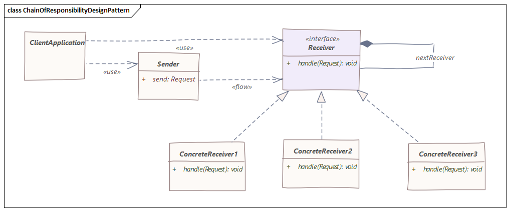

# 责任链模式
> 击鼓传花

## 特性
责任链模式允许多个类尝试独立处理请求，请求的Receiver对象不受顺序限制，可以按任何顺序进行处理。

此模式根据请求类型将发送方和接收方对象解耦，该模式定义了一个接收器对象链，它负责根据运行时条件处理请求或将其转发到链上的下一个接收器。

这种模式帮助我们避免了请求的发送者和接收者对象的耦合，并允许我们为请求拥有多个接收者。

## 图示



## 例子
假如你去ATM取钱，ATM支持10块、20块、50块和100块，你要取380块，ATM就会给你3张100的，1张50的，1张20和一张10块的。这个过程就可以用责任链模式来模拟。

先定义一个PaperCurrency类来保存要提取的金额

```java
public class PaperCurrency {

    protected int amount;

    public PaperCurrency(int amount) {
        super();
        this.amount = amount;
    }
}
```
现在让我们定义一个具有两个主要目的的分配器抽象类：（1）处理特定面值的纸币的分配。（2）去另一个分配器处理较小面值的纸币。

这是PaperCurrencyDispenser抽象类的代码：
```java
public abstract class PaperCurrencyDispenser {

    protected PaperCurrencyDispenser next;

    public void setNext(PaperCurrencyDispenser next) {
        this.next = next;
    }

    public abstract void dispense(PaperCurrency paper);
}
```
接下来就是处理100、50、20和10块的类，这些类都只是重写了`dispense`方法。
```java
public class HundredDispenser extends PaperCurrencyDispenser {

    public HundredDispenser() {
        super();
    }

    @Override
    public void dispense(PaperCurrency paper) {
        if (paper != null) {
            int amount = paper.getAmount();
            int remainder = amount;

            if (amount >= 100) {
                int count = amount / 100;
                remainder = amount % 100;
                System.out.printf("Dispensing '%d' 100￥ currency note\n", count);
            }

            if (remainder > 0 && this.next != null) {
                this.next.dispense(new PaperCurrency(remainder));
            }
        }
    }
}
```
现在我们将定义ATM取款流程，以定义纸币提款机的使用，我们将按面值从高到低的顺序排列纸币分配器。

这是ATMWithdrawal类的代码：
```java
public class ATMWithdrawal {

    protected static PaperCurrencyDispenser hundredDispenser = new HundredDispenser();
    protected static PaperCurrencyDispenser fiftyDispenser = new FiftyDispenser();
    protected static PaperCurrencyDispenser twentyDispenser = new TwentyDispenser();
    protected static PaperCurrencyDispenser tenDispenser = new TenDispenser();
    protected static PaperCurrencyDispenser dispenserChain;

    static {
        hundredDispenser.setNext(fiftyDispenser);
        fiftyDispenser.setNext(twentyDispenser);
        twentyDispenser.setNext(tenDispenser);
        dispenserChain = hundredDispenser;
    }

    public static void withdraw(PaperCurrency paper) {
        if (paper != null) {
            dispenserChain.dispense(paper);
        }
    }
}
```
最后我们来测试代码：
```java
public class Main {

    public static void main(String[] args) {
        try (Scanner scanner = new Scanner(System.in)) {
            do {
                System.out.println("Please enter amount to withdraw (multiple of 10, max 1000￥, Press Ctrl + C to end): ");
                int amount = scanner.nextInt();
                if (isValid(amount)) {
                    ATMWithdrawal.withdraw(new PaperCurrency(amount));
                }
            } while (true);
        }
    }

    private static boolean isValid(int amount) {
        if (amount <= 0) {
            System.out.println("Invalid amount. Try again!");
            return false;
        } else if (amount > 1000) {
            System.out.println("Daily withdrawal limit is 1000$. Try again!");
            return false;
        } else if (amount % 10 != 0) {
            System.out.println("Amount must be multiple of 10s, Try again!");
            return false;
        }
        return true;
    }
}
```
运行结果：
```
请输入要提取的金额（必须是10的倍数，最大1000, Ctrl+C退出): 
150
取出'1'张100元纸币
取出'1'张50元纸币
请输入要提取的金额（必须是10的倍数，最大1000, Ctrl+C退出): 
20
取出'1'张20元纸币
```

## 结论
源代码见[github](https://github.com/surzia/design-pattern)