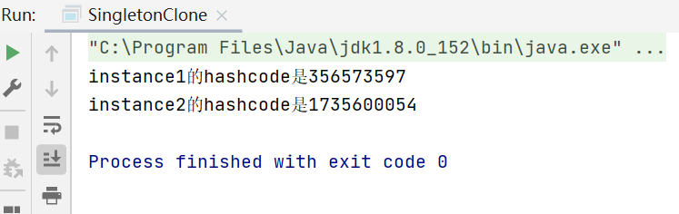
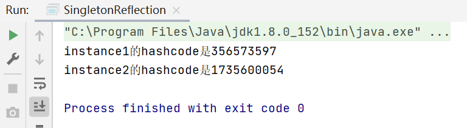

# 单例模式

> 单例模式，顾名思义代表了单独一个实例。一个类只有对象产生，并只提供一个访问对象的方法，典型的单身狗思想。

## 单例的不同情况

一个最简单的单例模式样例：

```java
public class Singleton {
    private static Singleton instance;
    
    // private constructor
    // 无法通过new关键字来获取新的实例
    private Singleton() {}
    
    // 提供一个访问对象的方法
    public static Singleton getInstance()
    {
        if (instance == null)
            instance = new Singleton();
        return instance;
    }
}
```

单例设计模式意味着Java虚拟机里只能有一个类对象，我们知道Java可以通过new、clone和reflection来实例化一个类对象，要想实现单例模式，在使用不同方式实例化类对象是需要满足不同约束条件。

- new：如上例子所示，我们将类的构造器私有化，即private constructor
- clone：继承java.lang.Clonable接口并重写clone()方法让其返回与类相同的单例对象
- reflection：使用枚举，但不支持延迟初始化 

上面的例子针对了new关键字，下面再来看看clone和reflection对应的情况。

首先是clone，clone的概念是创造重复的对象，得到对象的复制对象。假设我们创建了一个单例对象的clone，这样的话单例类就有两个对象，因此不能再称为单例对象。

```java
public class SingletonClone {

    public static void main(String[] args) throws CloneNotSupportedException {
        Singleton instance1 = Singleton.instance;
        Singleton instance2 = (Singleton) instance1.clone();
        System.out.println("instance1的hashcode是" + instance1.hashCode());
        System.out.println("instance2的hashcode是" + instance2.hashCode());
    }
}

class SuperClass implements Cloneable {

    @Override
    protected Object clone() throws CloneNotSupportedException {
        return super.clone();
    }
}

class Singleton extends SuperClass {

    public static Singleton instance = new Singleton();

    private Singleton() {
    }
}
```

输出结果：



两个不同的hashcode代表了存在两个不同的单例对象，这样就出现了问题。若要解决此问题，要重写clone()方法并从clone()方法中抛出异常CloneNotSupportedException。 现在，每当用户尝试创建单例对象的克隆时，它将抛出异常，因此我们的类仍然是单例。

```java
class Singleton extends SuperClass {

    @Override
    protected Object clone() throws CloneNotSupportedException {
        throw new CloneNotSupportedException();
    }
}
```

输出结果：


现在，我们已停止用户创建单例类的克隆。 当然这样对用户是不友好的，因此我们还可以从clone方法返回相同的实例。

```java
class Singleton extends SuperClass {

    @Override
    protected Object clone() throws CloneNotSupportedException {
        return instance;
    }
}
```

现在运行程序，结果就如预期了。


再来看reflection，反射可能导致破坏单例类的单例属性，如以下示例所示：

```java
public class SingletonReflection {

    public static void main(String[] args) {
        SingletonForReflection instance1 = SingletonForReflection.instance;
        SingletonForReflection instance2 = null;
        try {
            Constructor[] constructors = SingletonForReflection.class.getDeclaredConstructors();
            for (Constructor constructor : constructors) {
                constructor.setAccessible(true);
                instance2 = (SingletonForReflection) constructor.newInstance();
                break;
            }
        } catch (Exception e) {
            e.printStackTrace();
        }
        System.out.println("instance1的hashcode是" + instance1.hashCode());
        assert instance2 != null;
        System.out.println("instance2的hashcode是" + instance2.hashCode());
    }
}

class SingletonForReflection {

    public static SingletonForReflection instance = new SingletonForReflection();

    private SingletonForReflection() {
    }
}
```

输出结果：



要解决这个问题也很简单，将SingletonForReflection定义为一个枚举：

```java
public enum SingletonForReflection {
    INSTANCE;
}
```

这样再次运行代码是就会报错，JVM 会阻止反射获取枚举类的私有构造方法。


## 单例模式实现方式

在Java中，我们有很多创建单例模式的方法，这里需要搞清楚的是，为什么是以这种方式创建单例模式。

### 饿汉式

饿汉式有几个特点：

- 构造器私有
- 创建了一个属于单例类的私有常量静态变量
- 有静态/工厂方法，该方法返回作为类成员实例创建的单例类的对象
- 还可以将静态成员标记为public，直接访问常量静态实例
- 因此，单例类在实例化方面与普通Java类不同。对于普通类，我们使用构造函数，而对于单例类，我们使用getInstance()方法。

```java
public class SingletonEager {

    private static final SingletonEager instance = new SingletonEager();

    private SingletonEager() {
    }

    public static SingletonEager getInstance() {
        return instance;
    }
}
```

### 懒汉式

懒汉式不同的点在于，不直接实例化常量静态实例，而是在静态/工厂方法中做判断。

```java
public class SingletonLazy {

    private static SingletonLazy instance = null;

    private SingletonLazy() {
    }

    public static SingletonLazy getInstance() {
        if (instance == null) {
            synchronized (SingletonLazy.class) {
                instance = new SingletonLazy();
            }
        }
        return instance;
    }
}
```

这里加锁是为了保证是严格意义上的单例模式，否则将不支持多线程，即在多线程情况下不再是单例对象。这种模式下第一次调用才初始化，避免内存浪费，但加锁会影响效率。 

### 双检锁/双重校验锁

```java
public class SingletonLazyDoubleLock {

    private static SingletonLazyDoubleLock instance = null;

    private SingletonLazyDoubleLock() {
    }

    public static SingletonLazyDoubleLock getInstance() {
        if (instance == null) {
            synchronized (SingletonLazyDoubleLock.class) {
                if (instance == null) {
                    instance = new SingletonLazyDoubleLock();
                }
            }
        }
        return instance;
    }
}
```

在这里，可能会出现一个问题。假设有两个线程在运行，当实例为null时，两者都可以同时进入if语句内部。然后，一个线程进入同步块以初始化实例，而另一个则被阻塞。 当第一个线程退出同步块时，等待线程进入并创建另一个单例对象。请注意，当第二个线程进入同步块时，它不会检查实例是否为非空。

所以，需要有一个双重检验锁，如上所示，只有第一个抢到锁的线程才会创建实例。

### 静态内部类

此方法基于Java语言规范（JLS）。Java虚拟机仅按需加载静态数据成员。因此，在这里，类SingletonNestInnerClass首先由JVM加载。由于该类中没有静态数据成员；SingletonClassHolder不会加载或创建instance。

```java
public class SingletonNestInnerClass {

    private SingletonNestInnerClass() {
    }

    private static class SingletonClassHolder {
        static final SingletonNestInnerClass instance = new SingletonNestInnerClass();
    }

    public static SingletonNestInnerClass getInstance() {
        return SingletonClassHolder.instance;
    }
}
```

仅当我们调用getIntance方法时才会发生这种情况。JLS保证了类初始化的顺序执行，这意味着线程安全。因此，我们实际上不需要为加载和初始化在静态getInstance()方法上提供显式同步。 在这里，由于初始化以顺序方式创建了静态变量instance，因此getInstance()的所有并发调用将返回相同的正确初始化的instance，而没有同步开销。

### 枚举

```java
public enum Singleton {
    INSTANCE;
}
```

上述所有方法并非在所有情况下都是完全可靠的。我们仍然可以使用序列化或反射来创建上述实现的多个实例。在这两种情况下，我们都可以绕过私有构造函数，因此可以轻松创建多个实例。因此，新方法是通过使用枚举创建单例类，因为枚举字段是已编译的时间常数，但它们是其枚举类型的实例。并且，它们是在首次引用枚举类型时构造的。

## 总结

总而言之，单例设计模式仅表示我们希望确保JVM中只有一个实例，所有的问题都是围绕这一点来考虑。

以上源代码已经上传至[Github](https://github.com/surzia/design-pattern)