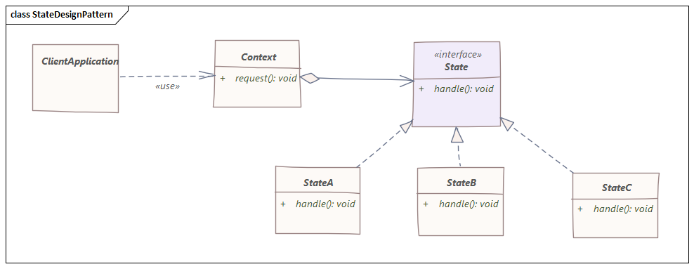
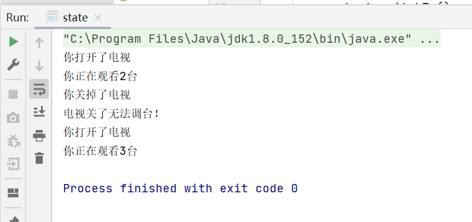
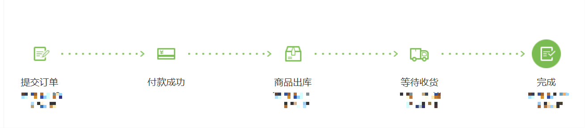
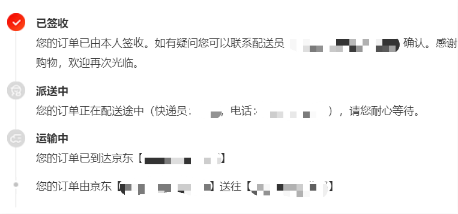
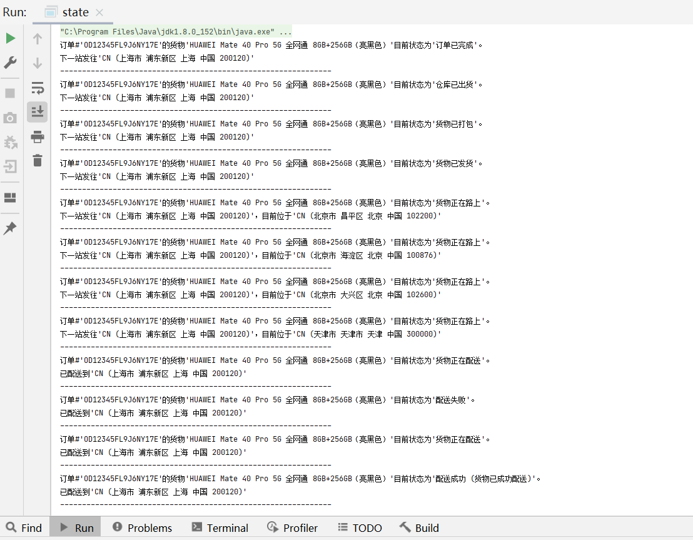

# 状态模式

> 状态设计模式，一种行为设计模式，允许对象在内部状态发生变化时改变它的行为。

## 特性

- 一种行为设计模式，[设计模式四人帮](https://en.wikipedia.org/wiki/Design_Patterns)之一
- 允许对象内部状态变化时改变行为
- 和[有限状态机](https://en.wikipedia.org/wiki/Finite-state_machine)概念相似
- 类似于“策略设计模式”，它提供了一种通过调用模式接口中定义的方法来切换策略的方法
- 根据对象的内部状态变化封装了对象的各种行为
- 为对象在运行时更改其行为提供了一种更简洁的方法

## 详细说明



上图为状态模式核心流程图，为了实现这一模式，必须要定义一个状态接口State，在这个接口中会定义一系列的动作。

举一个具体的例子来说明，带遥控器的电视就是一种状态模式，我们可以通过按遥控器上的按钮来更改电视的状态。但是电视的状态是否会改变，取决于电视的当前状态。如果电视开着，我们可以将其关闭，静音或更改外观和信号源。
但是，如果电视关闭，则按遥控器上的按钮时什么也不会发生。

这里简单起见，定义电视状态接口中包含三个动作，分别为：打开电视、关掉电视以及调台。根据上述，当电视关了之后是没办法调换电视台的。

```java
public interface TvState {

    //关掉电视
    void shutdown();

    //打开电视
    void turn();

    //调台
    void change();
}
```

接着初始化电视对象，我们简化模型，只给电视添加一个数组属性，代表电视台数组。

```java
public class TV {

    protected int[] station = new int[10];

    public TV() {
        for (int i = 0; i < 10; i++) {
            station[i] = i;
        }
    }

    public int[] getStation() {
        return station;
    }

    public void setStation(int[] station) {
        this.station = station;
    }
}
```

对于这里的context，也就是环境来说，需要实例化电视对象和状态对象，然后进行操作，这里假设电视机默认是开的。

```java
public class Context {

    protected TV tv;
    protected TvState state;

    public Context(TV tv) {
        this.tv = tv;
        //OpenTvState代表电视机是开的状态
        state = new OpenTvState();
    }

    public TV getTv() {
        return tv;
    }

    public void setTv(TV tv) {
        this.tv = tv;
    }

    public TvState getState() {
        return state;
    }

    public void setState(TvState state) {
        this.state = state;
    }
}
```

那么电视机是开的情况下可以做什么呢？很容易想到，它可以关机和调台，但是不能开机了，所以在这个状态里，需要重写状态接口定义的动作。

```java
public class OpenTvState implements TvState {

    public OpenTvState() {
        System.out.println("你打开了电视");
    }

    @Override
    public void shutdown(Context context) {
        context.setState(new CloseTvState());
    }

    @Override
    public void turn(Context context) {
        System.out.println("电视已经开了");
    }

    @Override
    public void change(Context context) {
        System.out.printf("你正在观看%s台\n", context.getTv().getStation()[new Random().nextInt(10)]);
    }
}
```

电视机开的情况下，我们用一个随机函数模拟当前观看的电视台，同样的，电视机关闭的状态也类似定义如下：

```java
public class CloseTvState implements TvState {

    public CloseTvState() {
        System.out.println("你关掉了电视");
    }

    @Override
    public void shutdown(Context context) {
        System.out.println("电视已经关了");
    }

    @Override
    public void turn(Context context) {
        context.setState(new OpenTvState());
    }

    @Override
    public void change(Context context) {
        System.out.println("电视关了无法调台！");
    }
}
```

最后，我们还需要为context环境类添加几个方法，分别对应打开电视、关闭电视和调台，在Context.java里添加：

```java
public class Context {
    public void switchTv() {
        this.state.change(this);
    }

    public void turnOn() {
        this.setState(new OpenTvState());
    }

    public void turnOff() {
        this.setState(new CloseTvState());
    }
}
```

我们编写一个测试类来运行上述过程：

```java
public class Main {

    public static void main(String[] args) {
        //初始化电视
        TV tv = new TV();
        //初始化环境，此时电视默认被打开
        Context context = new Context(tv);
        //调台，随机输出一个电视台
        context.switchTv();
        //关掉电视
        context.turnOff();
        //再调台，这时会提示电视已经关了无法调台
        context.switchTv();
        //再打开电视
        context.turnOn();
        //再调台，随机输出一个电视台
        context.switchTv();
    }
}
```

输出结果如下：



## 复杂一点的例子

先看一个例子，让我们以“发货处理”为例，其中订单状态从一个地方更改为另一个地方。运送时可能还会有例外情况，如果客户不满意，也可以退货。

先看一个快递发货的物流图：





可以看到订单从发货到签收状态是不断变化的，有时候还会出现地点信息，并有时没有及时取件会导致配送失败，这一过程也可以通过状态模式来设计实现。

> *为了节省不必要篇幅，以下代码均省去了getter/setter*

首先我们定义一个货物类

```java
public class Goods {

    protected String orderNumber;
    protected String orderItem;
    protected String goodsNumber;
    protected Location deliveryAddress;

    public Goods(String orderNumber, String orderItem, Location deliveryAddress) {
        this.orderNumber = orderNumber;
        this.orderItem = orderItem;
        this.deliveryAddress = deliveryAddress;
    }

    public String getOrderNumber() {
        return orderNumber;
    }

    public void setOrderNumber(String orderNumber) {
        this.orderNumber = orderNumber;
    }

    public String getOrderItem() {
        return orderItem;
    }

    public void setOrderItem(String orderItem) {
        this.orderItem = orderItem;
    }

    public String getGoodsNumber() {
        return goodsNumber;
    }

    public void setGoodsNumber(String goodsNumber) {
        this.goodsNumber = goodsNumber;
    }

    public Location getDeliveryAddress() {
        return deliveryAddress;
    }

    public void setDeliveryAddress(Location deliveryAddress) {
        this.deliveryAddress = deliveryAddress;
    }
}
```

既然货物有地址属性，那么还需要创建地点类

```java
public class Location {

    protected String code;
    protected String address;
    protected String area;
    protected String city;
    protected String country;
    protected String zipCode;

    public Location(String code, String address, String area, String city, String country, String zipCode) {
        this.code = code;
        this.address = address;
        this.area = area;
        this.city = city;
        this.country = country;
        this.zipCode = zipCode;
    }

    @Override
    public String toString() {
        return code + " (" + address + " " + area + " " + city + " " +
                country + " " + zipCode + ")";
    }
}
```

接下来就需要定义我们的状态接口，这将使我们可以随时拥有不同的装运状态（取决于我们的逻辑和输入参数）。

```java
public interface GoodsState {

    //name表示每个状态名字，类似上图中运输中、配送中、已签收等
    String name();

    void processGoods(GoodsContext context);
}
```

依据上图，下一步就需要完成context class，这里理解为上下文、环境个人认为都没有问题。

```java
public class GoodsContext {

    protected Goods goods;
    protected GoodsState state;
    protected boolean customerAtLocation = false;
    protected int currentLocationIndex = 0;

    public GoodsContext(Goods goods) {
        this.goods = goods;
        this.state = new OrderPlaced();
    }
}
```

在构造函数中，我们新建了一个OrderPlaced类，这个类和之前电视机例子中默认电视机打开状态类似，同样地继承状态接口，并实现了接口定义的方法。这个类就可以表示不同订单/货物下单完成的状态。

```java
public class OrderPlaced implements GoodsState {

    @Override
    public String name() {
        return "订单已完成";
    }

    @Override
    public void processGoods(GoodsContext context) {
        Goods goods = context.getGoods();
        System.out.printf("订单#'%s'的货物'%s'目前状态为'%s'。\n下一站发往'%s'\n", goods.getOrderNumber(), goods.getOrderItem(), name(), goods.getDeliveryAddress());
        System.out.println("--------------------------------------------------------------");
        context.setState(new ProcessingStock());
    }
}
```

在重写的processGoods方法中，状态被定义为了ProcessingStock，代表进入了下一个状态——“仓库已出货”。

```java
public class ProcessingStock implements GoodsState {

    public ProcessingStock() {
        super();
    }

    @Override
    public String name() {
        return "仓库已出货";
    }

    @Override
    public void processGoods(GoodsContext context) {
        Goods goods = context.getGoods();
        System.out.printf("订单#'%s'的货物'%s'目前状态为'%s'。\n下一站发往'%s'\n", goods.getOrderNumber(), goods.getOrderItem(), name(), goods.getDeliveryAddress());
        System.out.println("--------------------------------------------------------------");
        context.setState(new ReadyForPacking());
    }
}
```

类似的，进入了下一个状态——“货物已打包”

```java
public class ReadyForPacking implements GoodsState {

    public ReadyForPacking() {
        super();
    }

    @Override
    public String name() {
        return "货物已打包";
    }

    @Override
    public void processGoods(GoodsContext context) {
        Goods goods = context.getGoods();
        System.out.printf("订单#'%s'的货物'%s'目前状态为'%s'。\n下一站发往'%s'\n", goods.getOrderNumber(), goods.getOrderItem(), name(), goods.getDeliveryAddress());
        System.out.println("--------------------------------------------------------------");
        context.setState(new ReadyToDeliver());
    }
}
```

再下一个状态——“货物已发货”就有点不一样了，因为货物已经发出，所以新增了地点信息。

```java
public class ReadyToDeliver implements GoodsState {

    public ReadyToDeliver() {
        super();
    }

    @Override
    public String name() {
        return "货物已发货";
    }

    @Override
    public void processGoods(GoodsContext context) {
        Goods goods = context.getGoods();
        System.out.printf("订单#'%s'的货物'%s'目前状态为'%s'。\n下一站发往'%s'\n", goods.getOrderNumber(), goods.getOrderItem(), name(), goods.getDeliveryAddress());
        System.out.println("--------------------------------------------------------------");
        Location origin = new Location(
                "CN",
                "北京市",
                "海淀区",
                "北京",
                "中国",
                "100876"
        );
        context.setState(new DeliveryInProgress(ItineraryFinder.find(origin, context.getGoods().getDeliveryAddress())));
    }
}
```

发完货就进入了下个状态——“货物正在路上”，除了新增了地点信息外，这里还添加了模拟的中途站点信息。

```java
public class ItineraryFinder {

    public static List<Location> find(Location origin, Location deliveryAddress) {
        return Arrays.stream(new Location[]{
                origin,
                new Location("CN", "北京市", "大兴区", "北京", "中国", "102600"),
                new Location("CN", "天津市", "天津市", "天津", "中国", "300000"),
                new Location("CN", "上海市", "浦东新区", "上海", "中国", "200120"),
                deliveryAddress
        }).collect(Collectors.toList());
    }
}
```

```java
public class DeliveryInProgress implements GoodsState {

    protected List<Location> goodsItinerary;

    public DeliveryInProgress(List<Location> locations) {
        super();
        this.goodsItinerary = locations;
    }

    @Override
    public String name() {
        return "货物正在路上";
    }

    @Override
    public void processGoods(GoodsContext context) {
        int currentLocationIndex = context.getCurrentLocationIndex();
        Goods goods = context.getGoods();
        System.out.printf(
                "订单#'%s'的货物'%s'目前状态为'%s'。\n下一站发往'%s'\n目前位于'%s'\n",
                goods.getOrderNumber(), goods.getOrderItem(), name(), goods.getDeliveryAddress(),
                goodsItinerary.get(currentLocationIndex++));
        System.out.println("--------------------------------------------------------------");
        if (currentLocationIndex == (goodsItinerary.size() - 1)) {
            context.setState(new OutForDelivery());
        } else {
            context.setCurrentLocationIndex(currentLocationIndex);
        }
    }
}
```

接下来就是配送环节了，这里需要注意，当配送失败时，需要再次尝试配送，因此这个状态可能进入两个状态。

```java
public class OutForDelivery implements GoodsState {

    public OutForDelivery() {
        super();
    }

    @Override
    public String name() {
        return "货物正在配送";
    }

    @Override
    public void processGoods(GoodsContext context) {
        Goods goods = context.getGoods();
        System.out.printf("订单#'%s'的货物'%s'目前状态为'%s'。\n已配送到'%s'\n", goods.getOrderNumber(),
                goods.getOrderItem(), name(), goods.getDeliveryAddress());
        System.out.println("--------------------------------------------------------------");
        if (context.isCustomerAtLocation()) {
            context.setState(new Delivered());
        } else {
            context.setState(new DeliveryAttempted("Customer not at Home!"));
        }
    }
}
```

如果配送成功，则添加一条成功的信息，等待签收完成。

```java
public class Delivered implements GoodsState {

    protected String deliveryNote;

    public Delivered() {
        super();
    }

    @Override
    public String name() {
        return "配送成功";
    }

    @Override
    public void processGoods(GoodsContext context) {
        Goods goods = context.getGoods();
        deliveryNote = "货物已成功配送";
        System.out.printf("订单#'%s'的货物'%s'目前状态为'%s (%s)'。\n已配送到'%s'\n", goods.getOrderNumber(),
                goods.getOrderItem(), name(), deliveryNote, goods.getDeliveryAddress());
        System.out.println("--------------------------------------------------------------");
        context.setState(new Received());
    }
}
```

如果配送失败，则再次尝试配送，这里为了简便，直接手动在代码里将用户位置状态设置为true，即配送失败一次后肯定会成功，实际逻辑可能比这个要复杂。

```java
public class DeliveryAttempted implements GoodsState {

    protected String reasonForUndelivered;

    public DeliveryAttempted(String reasonForUndelivered) {
        super();
        this.reasonForUndelivered = reasonForUndelivered;
    }

    @Override
    public String name() {
        return "配送失败";
    }

    @Override
    public void processGoods(GoodsContext context) {
        Goods goods = context.getGoods();
        System.out.printf("订单#'%s'的货物'%s'目前状态为'%s'。\n已配送到'%s'\n", goods.getOrderNumber(),
                goods.getOrderItem(), name(), goods.getDeliveryAddress());
        System.out.println("--------------------------------------------------------------");
        context.setCustomerAtLocation(true);
        context.setState(new OutForDelivery());
    }

    public String getReasonForUndelivered() {
        return reasonForUndelivered;
    }

    public void setReasonForUndelivered(String reasonForUndelivered) {
        this.reasonForUndelivered = reasonForUndelivered;
    }
}
```

最终，快递通过千山万水，到达了用户手中，状态不再转移。

```java
public class Received implements GoodsState {

    public Received() {
        super();
    }

    @Override
    public String name() {
        return "签收成功";
    }

    @Override
    public void processGoods(GoodsContext context) {
        Goods goods = context.getGoods();
        System.out.printf("订单#'%s'的货物'%s'目前状态为'%s'。\n已配送到'%s'\n", goods.getOrderNumber(),
                goods.getOrderItem(), name(), goods.getDeliveryAddress());
        System.out.println("--------------------------------------------------------------");
    }
}
```

同样的，需要在context设置一个接口，供外界环境使用，我们将之命名为process，处理货物进度的一个方法。

```java
public class GoodsContext {
    public void process() {
        state.processGoods(this);
    }
}
```

到这里，就要编写测试类来测试我们所有的程序了。

```java
public class Main {

    public static void main(String[] args) {
        Goods goods = new Goods(
                "OD12345FL9J6NY17E",
                "HUAWEI Mate 40 Pro 5G 全网通 8GB+256GB（亮黑色）",
                new Location(
                        "CN",
                        "北京市",
                        "昌平区",
                        "北京",
                        "中国",
                        "102200"
                )
        );
        GoodsContext context = new GoodsContext(goods);
        while (notReceived(context.getState())) {
            context.process();
        }
    }
}
```

这里的逻辑是，只要用户没拿到货物，就要一直配送，如何判断用户拿到货物没有呢？很简单，判断状态名称是否为签收成功即可。

```java
public class Main {
    private static boolean notReceived(GoodsState currentState) {
        return !"签收成功".equals(currentState.name());
    }
}
```

看一看测试结果：



一切顺利，至此这个例子也就全部介绍完了。

## 总结

在状态模式中，环境（Context）是包含状态的一种对象，从以上两个例子可以看出，在定义context类时，都实例化了状态对象，但环境自身并不处理状态相关行为，这些行为都被定义到了各自状态的重写方法中，因此，通常将环境(Context)
自身当作一个参数传递给具体的状态处理类。

以上源代码已经上传至[Github](https://github.com/surzia/design-pattern)