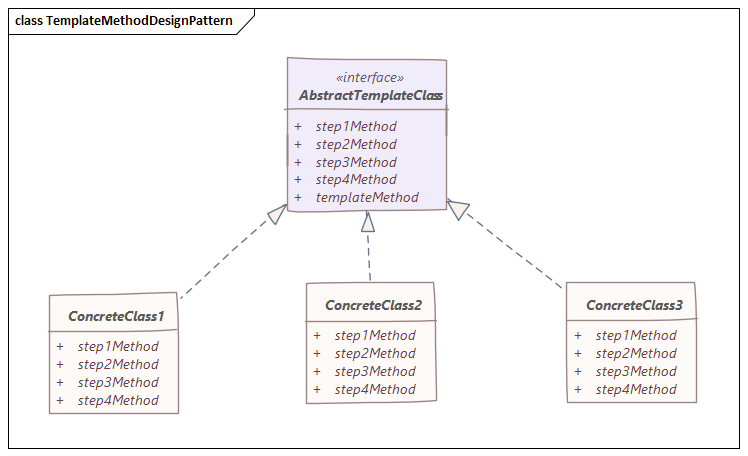

# 模板模式
> 通过抽象类定义抽象方法的执行顺序，然后交给子类去实现

## 特性
- 模板方法设计模式用于将算法定义为操作的框架，并保留要由子类实现的详细信息。
- 通过这种实现方式，算法的整体结构和顺序由父类保留。
- 模板方法模式定义了执行多步算法的顺序步骤，也可以提供默认实现。
- 在模板模式中，我们定义了一个称为模板方法的预设结构方法，该方法由步骤组成。
- 可以将这些步骤创建为抽象方法，该方法将由其子类实现。

## 结构


## 实例
以车辆生产线为例，首先定义车的抽象类
```java
public abstract class CarTemplate {

    protected String chassis;
    protected String body;
    protected String paints;
    protected String interior;

    public CarTemplate() {
        super();
    }

    // steps
    protected abstract void fixChassis();

    protected abstract void fixBody();

    protected abstract void paintCar();

    protected abstract void fixInterior();

    // template
    public void manufactureCar() {
        fixChassis();
        fixBody();
        paintCar();
        fixInterior();
    }
}
```
可以看到，暴露出的造车接口由四个步骤组成，分别对应定义的四个抽象方法，等造一类具体的车辆时，继承该类并实现所有的抽象方法即可。

以`ClassicCar`为例
```java
public class ClassicCar extends CarTemplate {

    public ClassicCar() {
        super();
    }

    @Override
    protected void fixChassis() {
        System.out.println("Assembling chassis of the classical model");
        this.chassis = "Classic Chassis";
    }

    @Override
    protected void fixBody() {
        System.out.println("Assembling body of the classical model");
        this.body = "Classic Body";
    }

    @Override
    protected void paintCar() {
        System.out.println("Painting body of the classical model");
        this.paints = "Classic White Paint";
    }

    @Override
    protected void fixInterior() {
        System.out.println("Setting up interior of the classical model");
        this.interior = "Classic Interior";
    }
}
```
在最后真正需要造车时，只调用抽象类中暴露的公共方法，这样就好像按照一套模板来走完了这个流程。
```java
public class Main {

    public static void main(String[] args) {
        CarTemplate classicCar = new ClassicCar();
        classicCar.manufactureCar();
        System.out.println("Below classic car delivered: ");
        System.out.println("======================================================================");
        System.out.println(classicCar);
    }
}
```