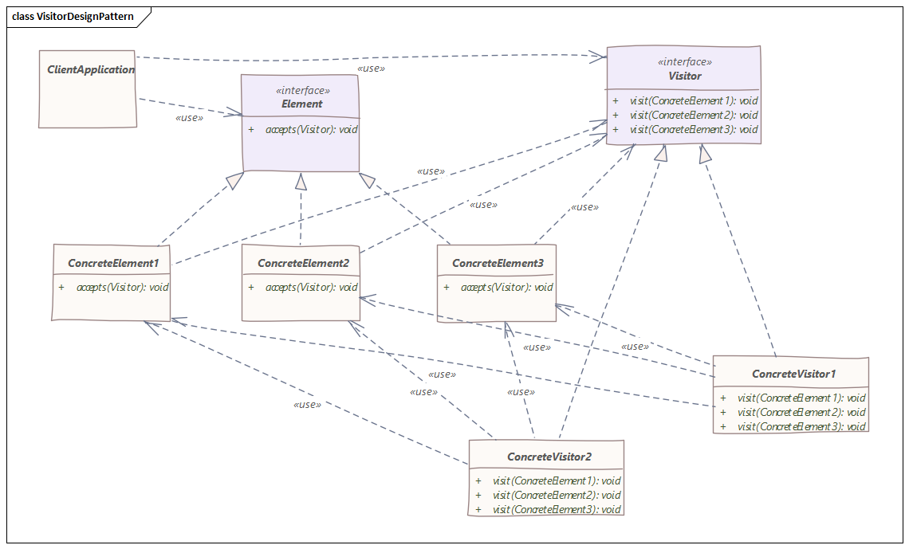

# 访问者模式
> 访问者模式是一种将算法与对象结构分离的软件设计模式

## 介绍
访问者模式的目的是定义一个新的操作而不引入对现有对象结构的修改。

想象一下，我们有一个由组件组成的复合对象。对象的结构是固定的——我们要么不能改变它，要么不打算在结构中添加新类型的元素。

现在，我们如何在不修改现有类的情况下为代码添加新功能？

访问者设计模式可能是一个答案。简单地说，我们要做的就是为结构的每个元素添加一个接受访问者类的函数。

这样，我们的组件将允许访问者实现“访问”它们并对该元素执行任何所需的操作。

换句话说，我们将从类中提取将应用于对象结构的算法。

因此，我们将充分利用`Open/Closed`原则，因为我们不会修改代码，但我们仍然可以通过提供新的`Visitor`实现来扩展功能。
## 实现

在上面的`UML`图中，我们有两个实现层次结构，专门的访问者和具体元素。

首先，客户端使用一个访问者实现并将其应用于对象结构。复合对象迭代其组件并将访问者应用于每个组件。

现在，特别相关的是具体元素（`ConcreteElementA`和`ConcreteElementB`）正在接受一个访问者，只是允许它访问它们。

最后，这个方法对于结构中的所有元素都是相同的，它通过将自身（通过`this`关键字）传递给访问者的访问方法来执行双重调度。
## 实例
我们的示例将是由`JSON`和`XML`具体元素组成的自定义`Document`对象；这些元素有一个共同的抽象超类，`Element`。

`Document`类：
```java
public class Document extends Element {

    List<Element> elements = new ArrayList<>();

    // ...

    @Override
    public void accept(Visitor v) {
        for (Element e : this.elements) {
            e.accept(v);
        }
    }
}
```

Element 类有一个接受访问者接口的抽象方法：
```java
public abstract class Element {
    
    public abstract void accept(Visitor v);
}
```
因此，在创建新元素时，将其命名为`JsonElement`，我们必须提供此方法的实现。

然而，由于访问者模式的性质，实现是相同的，所以在大多数情况下，它需要我们从其他已经存在的元素中复制粘贴样板代码：
```java
public class JsonElement extends Element {

    // ...

    public void accept(Visitor v) {
        v.visit(this);
    }
}
```
由于我们的元素允许任何访问者访问它们，假设我们想要处理我们的`Document`元素，但它们中的每一个都以不同的方式，取决于它的类类型。

因此，我们的访问者将对给定类型有一个单独的方法：
```java
public class ElementVisitor implements Visitor {

    @Override
    public void visit(XmlElement xe) {
        System.out.println(
                "processing an XML element with uuid: " + xe.uuid);
    }

    @Override
    public void visit(JsonElement je) {
        System.out.println(
                "processing a JSON element with uuid: " + je.uuid);
    }
}
```
在这里，我们的具体访问者实现了两种方法，每种元素对应一种。

这使我们可以访问结构的特定对象，我们可以在其上执行必要的操作。

出于测试目的，让我们看一下`Main`方法：
```java
public class Main {

    public static void main(String[] args) {

        Visitor v = new ElementVisitor();

        Document d = new Document(generateUuid());
        d.elements.add(new JsonElement(generateUuid()));
        d.elements.add(new JsonElement(generateUuid()));
        d.elements.add(new XmlElement(generateUuid()));

        d.accept(v);
    }

    private static String generateUuid() {
        return UUID.randomUUID().toString();
    }
}
```
首先，我们创建一个`ElementVisitor`，它包含我们将应用于元素的算法。

接下来，我们使用适当的组件设置`Document`并应用访问者，该访问者将被对象结构的每个元素接受。

输出将是这样的：
```
processing json element with uuid: fc5b4ed2-673a-4ac7-9faa-868e403f7373
processing json element with uuid: e87c74b6-7f75-4015-b80f-600366e6f972
processing xml element with uuid: a43f2945-dcc4-4c2f-b9a2-7bb6e29c46f4
```
即使是访问者也有其缺点，特别是如果我们需要向对象的结构中添加新元素，它的使用会使代码维护变得更加困难。

例如，如果我们添加新的`YamlElement`，则需要使用处理此元素所需的新方法更新所有现有访问者。 再进一步，如果我们有十个或更多的具体访问者，更新所有访问者可能会很麻烦。

除此之外，当使用这种模式时，与一个特定对象相关的业务逻辑会分布在所有访问者实现中。

## 结论
访问者模式非常适合将算法与其操作的类分开。除此之外，它使添加新操作更容易，只需提供一个新的访问者实现。

此外，我们不依赖于组件接口，如果它们不同，那很好，因为我们有一个单独的算法来处理每个具体元素。

此外，`Visitor`最终可以根据它所遍历的元素聚合数据。

以上源代码已经上传至[Github](https://github.com/surzia/design-pattern)